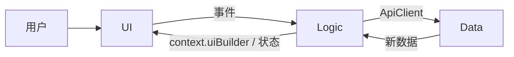
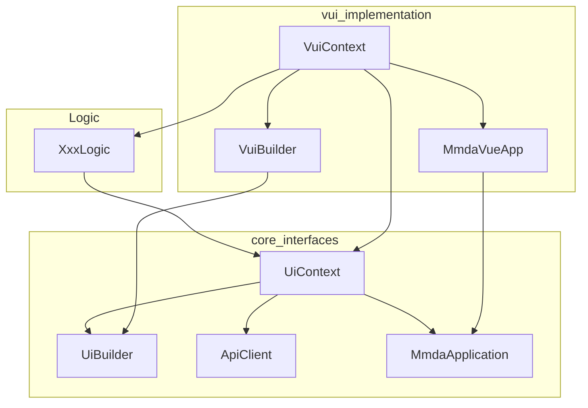

# MMDA 前端架构

**产品横向分层只有一处定义：本文。** 术语用词见 [docs/naming.md](docs/naming.md)；代理约束见 [AGENTS.md](AGENTS.md)；包内 API 细节见各包 `docs/`。重构见[分层架构](packages/core/docs/design/layers_architecture.md)

## UI → Logic → Data

```text
UI      vui + 皮肤        配置与展现：挂 Logic，显示 Logic 给出的状态
  ↑ 数据向下         ↓ 事件向上
Logic   交互逻辑          显示 / 锁定 / 校验 / 引用加码 / onChange；纯 TypeScript
  ↑ 新数据           ↓ 标准接口
Data    元数据·实体·HTTP  单一事实来源（SSOT）；不要在 UI 里直接碰
```

| 层 | 做什么 | 不做什么 |
|---|---|---|
| **UI** | 拼屏、控件、路由壳 | 业务计算、改共享元数据 |
| **Logic** | 交互：何时显示/锁定/校验、引用 `refWhere`、业务动作挂到会话 | Vue/React 类型、厂商控件、自己拼 URL |
| **Data** | 元数据、`MetaModel`、`ApiClient` | 界面组件、会话状态写回 `MetaUiField` |

层只与**相邻**层交互。皮肤不感知 Data。会话经 `context.apiClient` 做通用读写；业务动作由 Logic 挂到会话。Data 更新后再交给 Logic 刷新 UI。

### Logic 的依赖

Logic 是夹在 UI 与 Data 之间的**交互逻辑**：接收用户操作，决定显示 / 锁定 / 校验 / 引用加码 / 业务动作，再把结果交给两层邻居。它不直接画控件，也不自己拼 HTTP。

```text
用户操作 → UI 发事件 → Logic
                           ├─ 经 ApiClient（this.apiClient / context.apiClient）与 Data 交互
                           └─ 经 context.uiBuilder 与 UI 交互（confirm / toast / 输入…）
Data 回新数据 → Logic 更新状态 → UI 重绘
```

| 方向 | 通道 | 干什么 |
|---|---|---|
| **Logic → Data** | `ApiClient` | 读写实体、动作、查询。`this.apiClient` 与 `context.apiClient` 同一实例。实体 CRUD 用 Logic 方法；不要在 Logic 再包一层 `get` / `doAction` |
| **Logic → UI** | `context.uiBuilder` | Overlay（toast / confirm / dialog）；拼屏 `buildIndexView` / `buildSelectView` / `buildDetailsView` / `buildEditView`；原子控件 `factory.*` / 字段行 `fieldFactory.render`。换皮换实现，Logic 只认 core **四职**契约（见 [ui_four_roles_design.md](packages/core/docs/ui/ui_four_roles_design.md)） |
| **职责** | 处理用户交互 | 钩子、校验、`refWhere`、把业务函数挂到会话。不认 Vue/React 类型，不碰皮肤控件 |

Logic 只认 core **`UiContext`**。不要写成 vui `VuiContext` 或 rui `RuiContext`；不要从 `UiContext` 向下转型到运行时类。日常不要掏 `globalProps.$ui` / `$api`。



### 包怎么落层

| 层 | 包 / 目录 |
|---|---|
| UI | `@mmda/vui`（拼屏、会话）、`@mmda/vui-*`（皮肤控件与 factory） |
| Logic | `@mmda/core` 的 `src/logic/`（`EntityLogic` 等）；业务 `*Logic.ts` 在 `@mmda/base` / `@mmda/mes` 继承 `EntityLogic`；无定制的实体用 core 的 `GenericEntityLogic.resolve(di, token, …)`，不要再建空 Logic 子类 |
| Data | `@mmda/core` 的 `metaui` / `models` / `net` / `di` / `utils` |

`@mmda/core` **没有 UI 实现**；契约在 `src/ui/`（`UiBuilder` / `UiFactory` / `UiContext`）。core 里的 `logic/` 是产品 **Logic 层**，不是 Data 的子目录。

### Data 在 core 内的目录

内部依赖：`utils` → `metaui` → `models` → `net`。`di` 只依赖 utils。`metaui` / `models` / `utils` **不** import `logic/`。

| 目录 | 职责 |
|---|---|
| `metaui` | 服务端界面元数据；`Module` 在此；`MetaUiService` 可依赖 net |
| `models` | 实体框架；`MetaModel` 用元数据操纵实体 |
| `net` | HTTP / `ApiClient` |
| `di` / `utils` | 注入与工具（原 `extensions/` 的原型补丁已改为 `utils/` 纯函数） |

引用：元数据 `reference.where`（SQL 硬限制）不可改写；业务加码用 Logic `refWhere`，与 `where` AND。不要把 JS 过滤器写进 `MetaUiField`。

### UI 怎么画（一词一句）

```text
皮肤 Component  →  皮肤 Factory（用 MetaUi 生产）  →  vui Builder（拼工具栏/搜索/分页/对话框）
```

不要把 `SfGrid` / `AgGrid` 写进 `@mmda/vui`。细则用词见 [naming.md](docs/naming.md)。

### 业务包画页面：框架无关视图（`UiViewFn`）

业务包（`base` / `mes`）**只认 core**：不 import `vue` / `vue-router` / `vue-i18n`，也不 import 皮肤与厂商包。页面（模块首页、占位页这类非实体屏）写成 core 的页面级视图：

```text
UiViewFn<TNode>  =  (deps: UiViewDeps<TNode>) => TNode
UiViewDeps       =  { app: MmdaApplication; render: UiRenderer['render']; router: UiRouter }
```

| 需要什么 | 从哪拿 | 不要 |
|---|---|---|
| 状态 / 用户 / 模块 | `app.state` / `app.user` / `app.modules` | `inject(UI_APP_KEY)` |
| 文案 | `app.translate(key)`（core `TranslateFn`；vui 用 vue-i18n 实现） | `useI18n()` |
| 控件 | `app.ui.factory.*`（core `UiFactory` / `UiBuilder`） | 直接 import 皮肤控件 |
| 跳转 | `factory.link({ href: router.resolve(url) }, { default: () => [...] })` | `useRouter()` / 自绑 `onClick` |
| 壳节点 | `render(tag, props, children)`（Vue 是 `h()`，React 是 `createElement`） | `h()` |

宿主（`@mmda/app` 是 Vue 宿主）在 `packages/app/src/view_adapter.ts` 用 `hostedView(view)` 把它包成自己的组件：壳 / 渲染器 / 路由适配都在这一处装配，返回值在宿主的渲染 effect 里跑 —— 视图里读 `app.state.todoCount` 照样重渲，业务侧不写响应式代码。rui 宿主将来照抄同一契约（`MmdaReactApp` 已实现 `translate`）。

证明口径：`grep -rn "from 'vue'" packages/base/src` 为 **0**；`packages/base/package.json` 只依赖 `@mmda/core`。

### Builder：core 契约 → 运行时抽象类 → 皮肤

拼屏走模板方法，不要平行造一份 Host 接口，也不要把 vui 实现 alias 成 core 的 `UiBuilder`。

```text
UiBuilder              core 契约（框架无关）
    ↑
AbstractUiBuilder      core 共享实现（能上移的壳都在 core）
    ↑ implements
VuiBuilder / RuiBuilder   运行时抽象类：模板方法填共用拼屏
    ↑ extends
SfVuiBuilder / PrimeVuiBuilder / AgNaiveVuiBuilder / SfRuiBuilder
                       皮肤：控件与壳的具体落地
```

| 名字 | 包 | 职责 |
|---|---|---|
| **`UiBuilder<TNode>`** | `@mmda/core` | 接口：`toast` / `confirm` / `dialog` / `buildIndexView` / `buildDetailsView` / `buildEditView` / `factory`。Logic 只认这个 |
| **`VuiBuilder`** | `@mmda/vui` | 抽象类，`implements UiBuilder<VNode>`。共用拼屏（列表/表单/树分发、动作工厂）。注入类型用本类 |
| **`RuiBuilder`** | `@mmda/rui` | 抽象类，`implements UiBuilder<ReactNode>`。与 vui 对等，两边不互相 import |
| **皮肤 Builder** | `@mmda/vui-*` / `@mmda/rui-*` | `extends VuiBuilder` / `RuiBuilder`：壳、overlay、具体控件。如 `SfVuiBuilder`、`PrimeVuiBuilder`、`AgNaiveVuiBuilder`、`SfRuiBuilder` |

rui 已落地：`RuiBuilder` 与 vui 的 `VuiBuilder` 对等，契约都取自 core，两边不互相 import。程序员细则：[Builder 与皮肤](packages/vui/docs/builder.md)。

### 会话：`UiContext` 与 `VuiContext`

业务 Logic **只认 core `UiContext` 接口**（换 vui / rui / mui 仍是这一套）。vui 的 **`VuiContext`** 对标 Flutter `BuildContext`，给 **构造 / 拼屏 / 屏级 IO**用，不要写成业务钩子的类型。

```text
业务 *Logic.ts  ──►  core UiContext（接口）
                           ▲
                           │ implements
                    vui VuiContext  ≈ Flutter BuildContext（渲染 / 屏级拼装）
```

core 没有 vui 的 class。`UiContext` 上要声明的能力必须是 **core 里的框架无关接口**（不能 `any`）：`UiBuilder`、`ApiClient`（已有）、**`MmdaApplication`（abstract class）**。vui 实现类叫 **`MmdaVueApp extends MmdaApplication`**；rui 再继承同一套 `MmdaApplication`。

| Context 上 | 干什么 | 不是什么 |
|---|---|---|
| `uiBuilder` | 统一 UI（confirm / toast / 输入） | vui 带 VNode 的实现细节；不是 `$ui` |
| `apiClient` | 通用 HTTP | 不是 `globalProps.$api` |
| `app` | core **`MmdaApplication`**（鉴权、MetaUi、DI、locale；业务读 **`app.state`**） | 不是 Vue `App`；不是 `$app`。vui 实现类是 **`MmdaVueApp`**。弹层不在壳上，走 `app.ui` |
| Logic 挂上的函数 | `ApiClient` 没有的业务（校验、加码、专用动作） | 不要把 `get`/`doAction` 在 Logic 再包一遍 |
| `globalProps` | 把 Vue `globalProperties` **传递**下来 | 极少用；不是主 API |



### 三条路径

```text
通用数据 ── context.apiClient（= logic.apiClient） → Data（会话/UI 助手；不必经 Logic 再包）
业务实体 ── Logic 方法 / this.apiClient            → Data（CRUD、动作；与上同一实例）
业务操作 ── Logic 函数组装到 context               → 本屏交互 / 专用动作
UI       ── context.uiBuilder                     → 换皮（统一接口）
应用壳    ── context.app                           → MmdaApplication（读 app.state）
```

`this.apiClient` 与 `context.apiClient` 同一实例。实体 CRUD 优先走 Logic 方法；日常不要掏 `context.globalProps.$ui` / `$api`。

vui 现状：`VuiContext` 实现 core `UiContext`（含 `apiClient` getter）；`uiBuilder` 来自 `app.ui`。core 契约是 **`UiBuilder<TNode>`** 与 abstract class **`MmdaApplication`**；vui 拼屏抽象类是 **`VuiBuilder implements UiBuilder<VNode>`**（模板方法，`extends` core `AbstractUiBuilder`）；应用壳是 **`MmdaVueApp extends MmdaApplication`**。皮肤 **`SfVuiBuilder` / `PrimeVuiBuilder` extends `VuiBuilder`**。业务钩子参数用 core `UiContext`，不要 vui `VuiContext`。注入拼屏用 **`VuiBuilder`**，不要再造 Host，也不要把实现 alias 成 `UiBuilder`。

### 弹层与选记录

| 能力 | 走哪 | 不要 |
|---|---|---|
| 提示 / 是/否 / 塞内容 | `uiBuilder.toast` / `confirm` / `dialog` | 已删除的 `confirmMessage`、`confirmDialog`、`app.confirm` |
| 联想、列筛（无 UI） | `context.searchRelative(field, word)` | 把 hasOne 当小表灌 `refOptions` |
| 字段弹选并写回 | `context.select(field)` | `pickRelative` |
| 任意仓库勾选 | `context.select({ repository, service?, selectionMode })` | `buildSearchForRelativeContent`、`buildSelector` |
| 本地行勾选 | `MetaUiBuilder` + `builder.table` + `dialog` | 为本地数组再开一套仓库查询 |

业务 `*Logic.ts` 可以调 `factory` / `fieldFactory` / `buildIndexView` / `buildDetailsView` / `buildEditView`，但不要出现 Vue 类型。`viewOptions` 仍只返回选项。

程序员用法：[UI 四职](packages/core/docs/ui/ui_four_roles_usage.md)、[UiContext](packages/core/docs/logic/ui_context_usage.md)、[vui 会话怎么写](packages/vui/docs/context.md)、[vui 会话设计](packages/vui/docs/vue_ui_context.md)、[MetaUiBuilder](packages/core/docs/metaui/metaui_builder.md)。四职设计：[ui_four_roles_design.md](packages/core/docs/ui/ui_four_roles_design.md)。本轮弹层/壳改名记录：[refactor_ui_app.md](packages/core/docs/refactor_ui_app.md)。

## 单向数据流（摘要）

用户操作 → UI 发事件 → Logic 调 Data → Data 回新数据 → Logic 更新状态 → UI 重绘。  
UI 组件树里仍是数据向下、事件向上。
