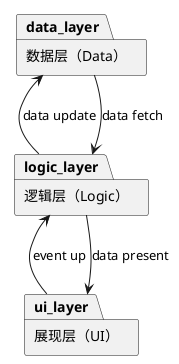
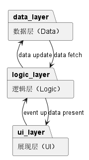
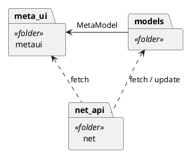
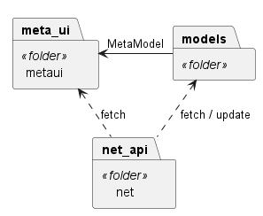
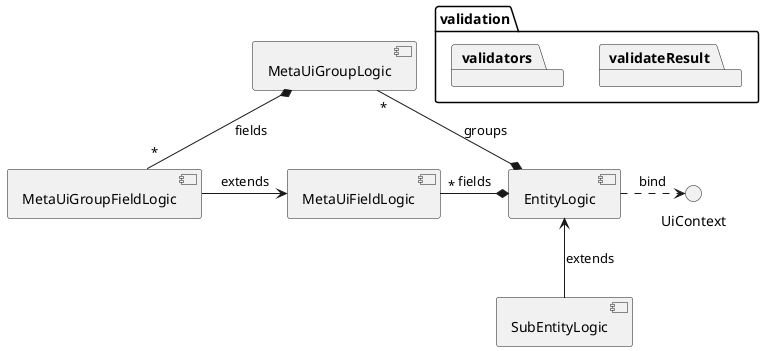
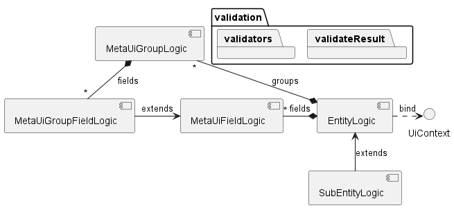
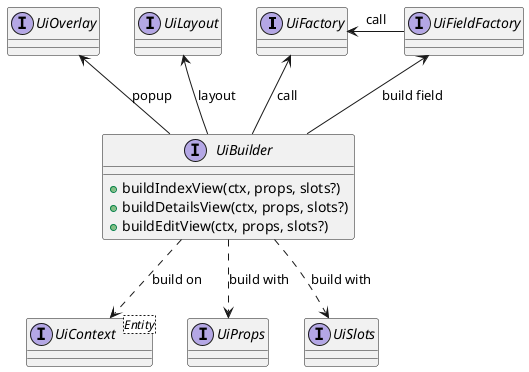
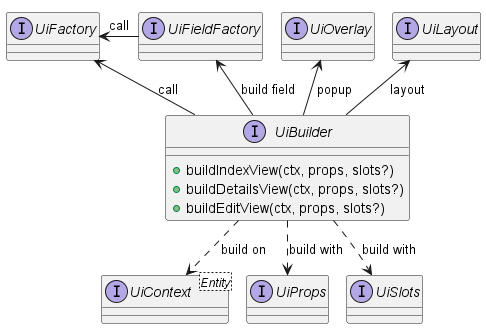
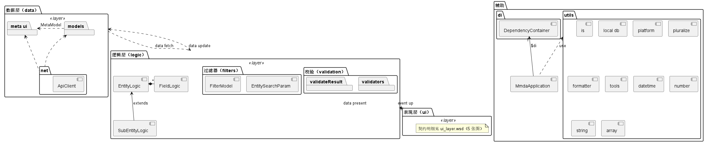

# 分层架构

元数据驱动架构（`MMDA`）前端框架分三层架构：

## 数据层（Data）

数据层（`data layer`）负责与数据源交互，例如本地数据库、服务器端API等，包括抓取数据和更新数据，统一的错误处理等。数据层暴露数据和方法给逻辑层。

在核心框架（`core`）中数据层主要包含：

1. 元数据（meta ui）是定义实体模型和关系、UI渲染和编辑组件的数据，驱动整个低代码框架运行的基石。元数据来自服务器端，除了跟UI相关的少数属性，其他的在前端不能更改；
2. 实体模型（models）是实体数据实例的抽象；
3. 网络API客户端（net）提供标准的数据源交互接口和能力；

## 逻辑层（Logic）

逻辑层（`logic layer`）实现核心交互逻辑，衔接数据层和展现层之间的互动。如果没有复杂的处理逻辑，例如只需要展现数据和修改数据（`CRUD`），这一层是可选的，允许在UI层通过`UiContext`会话上下文中的接口函数直接透过`ApiClient`接口提交数据。

逻辑层依赖数据层，但与具体UI层的实现技术无关，它不知道是`vue`,`react`还是什么技术实现的，它只与UI层的接口打交道，是纯粹的`ts`语言。因此程序员只需要关注交互逻辑，无需直面技术框架的复杂性。

实体逻辑（`EntityLogic`）本身是上下文无关的，组装进`UiContext`上下文后，使得逻辑函数真正应用于上下文中的实体模型。例如实体字段域的可见性、只读锁定、校验器、外观和数据变更监听器，子表逻辑、关联计算、选择数据源等。组装后的逻辑函数在`vue`的世界里变为了响应式`ref`,`watch`,`computed`属性。

## 展现层（UI）

展现层（`presentation layer`）即我们的UI层，负责显示来自逻辑层的数据给用户(display data exposed by logic layer)，处理用户交互(raise event up)。

构建用户界面（UI）主要接口有：

- UiFactory 定义了生产单个组件接口
- UiFieldFactory 定义了根据元字段域（MetaUiField）生产单个组件接口
- UiOverlay 弹层接口，confirm / alert / message / dialog
- UiLayout 负责界面布局，行 / 列 / 表格等
- UiBuilder 负责组装用户交互界面和各种视图
- UiContext 构建复杂组件和视图的上下文接口，buildXxx函数的第1个参数
- UiProps 构建一个组件的属性接口，buildXxx函数的第2个参数
- UiSlots 构建一个组件的插槽（子组件）接口
- UiEventArgs 一个组件因交互产生的事件（event up）参数

## core 包结构总览（图）

数据层（`metaui` / `models` / `net`）与辅助（`utils` / `di` / `MmdaApplication`）的包内落点，以及三层之间的四条通道（data fetch / data present / event up / data update）。表现层框只标位置，契约明细见 `docs/design/ui_layer.wsd` 的五张图。

图源：`docs/design/layers_architecture.wsd`（块名 `core_layer`）；重渲：`bash scripts/render-diagrams.sh`。
