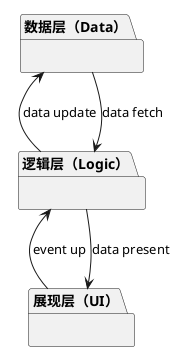

# 产品分层数据流

```plantuml
@startuml
<style>
 root {
   Margin 8
 }
</style>

package 数据层（Data） as data_layer {
}

package 逻辑层（Logic） as logic_layer {
}

package 展现层（UI） as ui_layer {
}

logic_layer -up-> data_layer : data update
ui_layer -up-> logic_layer : event up
data_layer -down-> logic_layer : data fetch
logic_layer -down-> ui_layer : data present
@enduml
```
