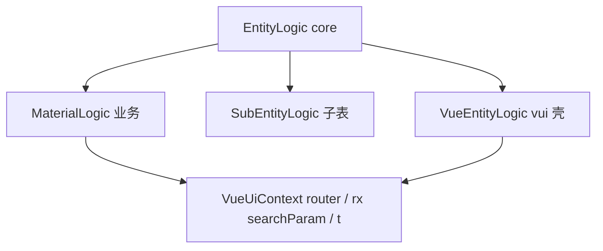

# EntityLogic 重构设计

产品分层仍是 **UI → Logic → Data**（[ARCHITECTURE.md](../../../../ARCHITECTURE.md)）。程序员用法见 [entity_logic_usage.md](./entity_logic_usage.md)。源码 [`entity_logic.ts`](../../src/logic/entity_logic.ts)。术语 [naming.md](../../../../docs/naming.md)。

## 为什么改

旧链路：

```text
EntityLogic（core，CRUD）
    ↑
UiLogic（vui：router / i18n / rx / 视图钩子）
    ↑
MaterialLogic
```

问题：

- 业务必须 `extends UiLogic`，Logic 层绑死 Vue（`vue-router`、`vue-i18n`、`rx`）。
- 类名带 `Ui`，像 UI 层，和「Logic 给 Vue / React 共用」冲突。
- `field` / `group` 在 vui 再包一层 `translateMessage`；配置错误没有 `UiContext`，却依赖 vui locale。
- `GenericUiLogic` 是空壳，只为 abstract 基类能 `new`。

## 目标链路

```text
EntityLogic（core：CRUD + 视图钩子 + applyTo(UiContext)）
    ↑
MaterialLogic          业务；无 Vue 类型
SubEntityLogic         子表；core
VueEntityLogic         仅 vui 壳：无定制仓库可 new；搜索表单 rx
```



rui 以后平行 `ReactEntityLogic`（若需要），业务仍 `extends EntityLogic`。

## 分层

| 类 | 包 | 谁用 | 职责 |
|---|---|---|---|
| `EntityLogic` | core | 程序员 `extends` | ApiClient CRUD、`beforeEdit` / `viewLogicLoaders`、`applyTo` |
| `SubEntityLogic` | core | 子表 Logic `extends` | 主表内存行，不走 HTTP `getAll` |
| `VueEntityLogic` | vui | **壳** `new`；业务不继承 | 覆盖 `createSearchForm` 用 `rx` |
| `VueUiContext` | vui | 运行时 | `router`、`searchParam = rx(...)`、`bindLogics`、`t()` |

已删除：`UiLogic`、`UiLogicInit`、`GenericUiLogic`、`UiGroupLogic`。

`MetaUiFieldLogic` / `MetaUiGroupLogic` **不是** 实体 Logic：它们是字段/组行为对象，由 `this.field()` / `this.group()` 创建，经 `applyTo` → `context.bindLogics` 挂到会话。不要和 `SubEntityLogic` 混名。

## 路由

导航是会话能力，不是实体 CRUD。

- `vue-router` 实例在 `VueUiContext.router`（`EntityView` 构造会话时注入）。
- `index` / `details` / `edit` / `create` / `routeTo` 在 vui mixin [`navigate.ts`](../../../vui/src/contexts/mixins/navigate.ts)。
- 动作 `redirectTo` 走 `context.router.push`，不读 `logic.router`。
- `EntityLogicInit` **没有** `router` / `i18n`。

业务跳转：`context.index()` / `context.edit(row)`。不要 `this.router`。

## 国际化

面向用户：钩子里 `context.t(...)` / `context.translate(...)`。core `UiContext` 声明；vui `VueUiContext` 实现。

`this.field()` / `this.group()` 在装配期 **没有** context，throw 是给程序员看的英文配置错误，留在 core `EntityLogic`。不要 vui `translateMessage`。

## 搜索响应式

两处，不要混：

1. **会话**：`VueUiContext` mixin 上 `searchParam = rx(...)`。列表 `init()` → `configureSearch(..., logic.beforeSearch())` 把 Logic 的表单拷进这份已 `rx` 的对象。`UiSearchField.searchVal` 本身是 `ref`。
2. **VueEntityLogic.createSearchForm**：给无定制 `new VueEntityLogic` 的搜索表单再 `rx` 一层。业务 `MaterialLogic extends EntityLogic` **不走** 这条；业务列表的响应式靠第 1 条。

## applyTo

`EntityLogic.applyTo(context, view)` 只认 core `UiContext`：`ensureViewLogic` → `beforeXxx` → `context.bindLogics?`。vui 在 `VueUiContext` 实现 `bindLogics`。

## 实例化（壳）

[`EntityView`](../../../vui/src/components/EntityView.ts)：

1. DI `${service}:${repository}Logic` → `new MaterialLogic(init)`（`EntityLogic` 子类）
2. 没有定制 → `new VueEntityLogic(defineEntity, init)`

跨仓库 `select()`、分类树同样：有 DI 用业务类，否则 `VueEntityLogic`。

## 不要

- 业务 `extends VueEntityLogic`
- Logic 上挂 `Router` / `I18n`
- 把 mixins 上移 core
- 再引入 `UiLogic` / `GenericUiLogic` / `UiGroupLogic`
