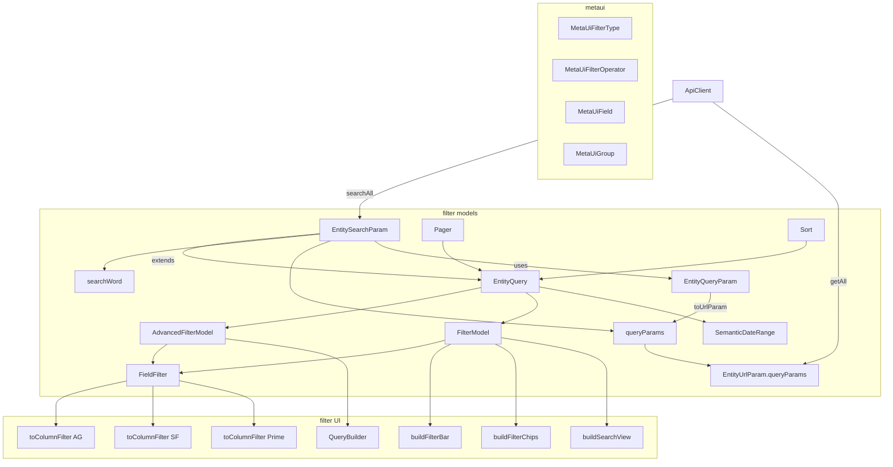

# 过滤框架设计

产品分层仍是 **UI → Logic → Data**。过滤跨 **metaui**（字段能怎么滤）和 **models**（用户滤了什么）。日期周期是文档展开的协作者，不是第三套 Filter API。

JSON 形状与日期规则仍见 [entity_search.md](./entity_search.md) / [date_filter.md](./date_filter.md)。程序员写法见 [entity_query_usage.md](../logic/entity_query_usage.md) / [date_filter_usage.md](../logic/date_filter_usage.md)。

旧快捷条 `MetaUiFilter` / `MetaUiFilterCondition`（SQL → `queryParams.filter`）**不进本模型**，可废。vui 芯片 UI 另开，协议改走 `FieldFilter`。

## 三列



## 传输

- 客户端中心是 **`EntitySearchParam`**。
- `searchAll`：**Body 只发 `FilterModel`**；pager / `searchWord` 走 URL。
- `getAll`：URL 走现有 **`EntityUrlParam.queryParams`**。不改 `ApiClient` 签名。
- **`EntityQueryParam`** 是工具，不是新的 ApiClient 参数。`toUrlParam()` 把简单条件收成 URL 袋，写入 `SearchParam.queryParams`。袋里还可以有 `moduleCode` 等通用项。

## filter models

**`EntityQuery`**：可保存为服务端 `CustomizedQuery`（`queryExpression`）。含 `FilterModel`、`AdvancedFilterModel`、SemanticDateRange、`pager`（`pager.sorts` 是唯一排序）。**不含** `searchWord`、**不含** `queryParams`。

**`EntitySearchParam` extends `EntityQuery`**，只多两样：

- **`searchWord`**：这一次的模糊搜，不进可保存查询。
- **`queryParams`**：融合 URL（兼容老写法）。

**`FilterModel`** / **`AdvancedFilterModel`** 是兄弟，叶子都是 **`FieldFilter`**：

| 现在 | 新名 |
|---|---|
| `EntityFilterModel` | `FilterModel` |
| `EntityAdvancedFilterModel` | `AdvancedFilterModel` |
| `EntityFieldFilter` | `FieldFilter` |
| `EntitySimpleFieldFilter` | `SimpleFieldFilter` |
| `EntitySetFieldFilter` | `SetFieldFilter` |
| `EntityBooleanFieldFilter` | `BooleanFieldFilter` |
| `EntityJoinFieldFilter` | `JoinFieldFilter` |
| `EntityMultiFieldFilter` | `MultiFieldFilter` |
| `EntityAdvancedJoinFilter` | `AdvancedJoinFilter` |
| `EntityAdvancedColumnFilter` | `AdvancedColumnFilter` |

JSON 键和 POST 形状不变。

**`SemanticDateRange`**（`TODAY` / `THIS_MONTH`）和 Query 同列。`dateKind` 保存和 POST 都原样，服务端展开。周期 token（年/月/日）仍是 `set` 的值。

## metaui 词汇表

### `MetaUiFilterType`

一份枚举两用：位掩码 = `field.filterTypes`；小写名 = `FieldFilter.filterType` JSON。

```ts
enum MetaUiFilterType {
  NONE = 0,
  TEXT = 1,
  NUMBER = 2,
  DATE = 4,
  BOOLEAN = 8,
  SET = 16,
  MULTI = 32,
  JOIN = 64,
}
```

配套 `MetaUiFilterTypeEnum.valueOf` / `nameOf`（成员名）/ `textOf`（JSON 小写）/ `hasFlag`。位置位也可用 `hasBit(mask, MetaUiFilterType.SET)`，与 `Module.allowOps` 相同。

服务端下发的 `filterTypes` **不会空**。`NONE` 只给本地还没写位的场合。JOIN / MULTI 各皮肤自己看位，不支持就降级。不要 core `resolve`。

### `MetaUiFilterOperator`

成员名 = JSON（`EQ`）。值 = 控件名（`equals` / `startsWith`）。`FieldFilter.operator` 仍发成员名。

```ts
enum MetaUiFilterOperator {
  EQ = 'equals',
  STARTS_WITH = 'startsWith',
}
```

### `MetaUiField` / `MetaUiFieldRef`

`MetaUiField` 只提供：

```ts
inferColumnFilterType(): MetaUiFilterType
// dataType + reference → boolean | date | number | text | set
// enum / ref / hasOne → set
```

不提供 `columnFilterKind` / `resolve` / `simpleFilterTypeOf`。列头画哪种壳是 UI 的事，不要在 core 造 `range`。

`MetaUiFieldRef.isRefOptionsFull`：enum 恒 true；ref / hasOne 看运行时是否穷尽。远程搜：`!ref.isRefOptionsFull`。

## filter UI

四条入口读写左列文档：QueryBuilder → Advanced；FilterBar / FilterChips / SearchView → FilterModel。

各家表格 **不**建 `GridColumn.filterModel`。标准只有 `FieldFilter`；AG / Syncfusion / Prime 各自 `toColumnFilter(fieldFilter)`。

## 不要

- 不要改 POST JSON（`filterType` 小写、`operator` 大写、`dateKind`、周期 token）。
- 不要在客户端把 `THIS_MONTH` 收成日期再保存。
- 不要对日期列当前页 `getDistinct`。
- 不要让 Data 依赖 Logic。
- 不要为每一步导出 `*Of` / `is*`。
- 不要把 `MetaUiFilter` SQL 适配成 `FieldFilter`。
