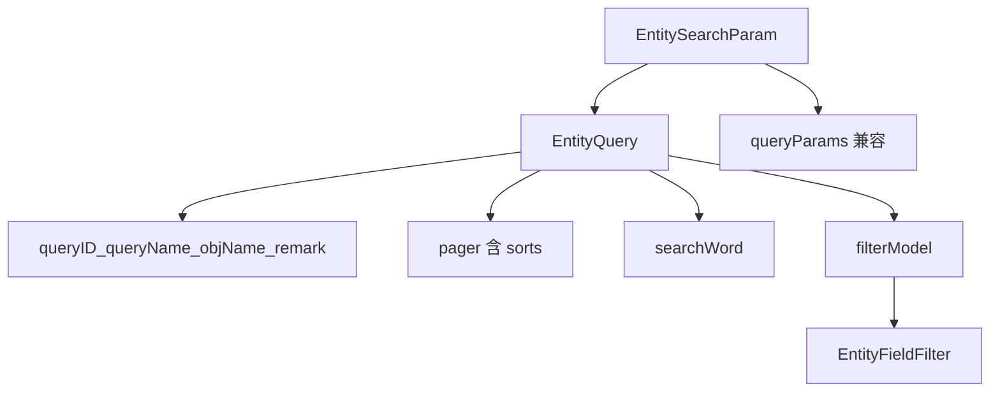

# 列表查询设计：EntityQuery / EntityFilterModel

- **层**：Data / models（传输在 net；套用与 SQL 片段在 logic；模块默认与本地缓存在 metaui）
- **源码**：[`packages/core/src/models/entity_search.ts`](../../src/models/entity_search.ts)
- **程序员怎么写**：[entity_query_usage.md](../logic/entity_query_usage.md)
- **日期过滤**：[date_filter.md](./date_filter.md) · [date_filter_usage.md](../logic/date_filter_usage.md)
- **SQL 片段**：[sql_operator.md](../logic/sql_operator.md)

对齐校验文档的写法：[validation_design.md](../logic/validation_design.md) / [validation_usage.md](../logic/validation_usage.md)。

## 为什么改

旧链路把「可保存的查询」和「当次 HTTP 请求」搅在一起：字段条件进 `queryParams`（或拼 SQL），排序有时另存一份，表头 FilterModel 又叫 `searchParams`。后果是：

- 程序员要在 URL 参数里塞 `IN USED` 这类伪 SQL；
- 自定义查询、本地上次查询、模块默认芯片格式不统一；
- UI / Logic / Data 边界模糊。

本轮把查询文档收成 **EntityQuery**，当次请求是 **EntitySearchParam**，字段条件只进 **filterModel**。

## 概念

| 名字 | 角色 |
|---|---|
| **EntityQuery** | 可保存的查询定义（客户端名） |
| **EntitySearchParam** | 当次列表请求 ≈ EntityQuery，另带兼容字段 `queryParams?` |
| **EntityFilterModel** | `Record<fieldName, EntityFieldFilter>`，Query 里的过滤文档 |
| **EntityFieldFilter** | 单字段条件（`EntitySimpleFieldFilter` \| set \| boolean；对齐 Java ColumnFilter） |
| **EntityFilterOperator** | `EQ` / `GE` / `IN` / `BETWEEN` …（JSON 成员名不变） |
| **NamedQueryRef** | `Module.defaultFilter` 解析出的 `{ queryID, queryName }` |

```ts
interface EntityQuery {
  queryID?: string
  queryName?: string
  objName?: string
  remark?: string
  filterModel?: EntityFilterModel
  pager: Pager          // 含 sorts；唯一排序来源
  searchWord?: string
}

interface EntitySearchParam extends EntityQuery {
  queryParams?: Record<string, unknown>  // 仅兼容；新代码不要写字段条件
}
```

服务端实体仍叫 [`CustomizedQuery`](../../../base/src/models/CustomizedQuery.ts)。  
**`queryExpression` = `JSON.stringify(EntityQuery)`**。旧纯 SQL 字符串用 `parseQueryExpression` 双读（`kind: 'sql'`）。列宽 `@Size` 变长另开，本轮不改 Java。

`queryParams` **不属于 EntityQuery**。`moduleCode` 等鉴权走 `searchAll` **第二个参数** `EntityUrlParam.queryParams`，不是查询文档的一部分。

## FieldFilter 形状

| filterType | 主要字段 |
|---|---|
| `text` / `number` / `date` | `operator` + `value` + 可选 `valueTo`；`date` 可另带 **`dateKind`**（`THIS_MONTH` 等，POST 不展开） |
| `set` | `values` + 可选 `operator`：`IN` / `NOT_IN`。日期列的 `values` 可以是周期 token：`YYYY` / `YYYY-MM` / `YYYY-MM-DD` |
| `boolean` | `value: boolean \| null`（`IS_ALL` 表示不筛选，通常不写入 model） |
| `join` | 同一比较器多段：`operator: "AND"\|"OR"` + `conditions[]` |
| `multi` | 同一列叠 **不同种类** 子过滤：`filterModels[]`（服务端 AND） |

`join` ≠ `multi`：两段 CONTAINS 用 join；CONTAINS + 选项 set 用 multi。只填一块时摊平为 simple/set，不要包一层空的 join/multi。

工厂：`inFilter` / `notInFilter` / `eqFilter` / `betweenFilter` / `dateKindFilter` / `nullFilter` / `joinFilter` / `multiFilter` / `combineCompareAndSet`。

日期两路：

- **语义** `{ filterType:'date', dateKind:'THIS_MONTH' }`：保存和 POST 都保留 kind，**服务端**按服务器日历展开成半开 `[start, next)`。不要在客户端收成 BETWEEN。
- **Excel 绝对勾选** `set` + 周期 token：`toSearchRequest` / `searchAll` 会 `expandDateFilters` 合并相邻区间 → 一段 `BETWEEN` 或多段 `join` OR。`dateKind` 不展开。

周期 token 先变半开区间再合并（`prev.next >= next.start`）。例：`['2026-05','2026-06-01','2025-12']` → 12 月一段 + `[2026-05-01, 2026-06-02)`。`compactDateSet` 对照 pivot 日把全选的年/月收成 token。

日期两路的展开规则、token 合并、表头 multi 见 **[date_filter.md](./date_filter.md)**，写法见 **[date_filter_usage.md](../logic/date_filter_usage.md)**。

运算符全集见源码 `EntityFilterOperator`。UI 标签用 i18n `matcher.${op}`，不要在 Logic 里挂中英文 label 对象。

## 分层

| 放哪 | 放什么 |
|---|---|
| **models** | EntityQuery / SearchParam / FilterModel / Operator；`stringifyQueryExpression` / `parseQueryExpression`；`parseDefaultFilter`；工厂函数 |
| **metaui** | `Module.defaultFilter` / `defaultSort` / `defaultGroupBy`；pack 的 `lastQuery` |
| **logic** | 套用默认查询、`refWhere`；**无 SearchOp**；SQL 用 `SqlOperator` |
| **net** | `searchAll`；`toSearchRequest` / `toQueryParams`；空 filterModel → GET |
| **vui** | 只读写 EntityQuery / SearchParam；芯片与表头运算符用 `EntityFilterOperator` |



## 传输：`searchAll`

```text
EntitySearchParam
  → toSearchRequest
      queryParams  ← pager + searchWord + 旧 queryParams（URL）
      filterModel  ← 有键才带（POST body）
  → 无 filterModel：GET getAll
  → 有 filterModel：POST .../searchAll，body = EntityFilterModel 映射
```

要点：

- HTTP body 仍是 **字段 → ColumnFilter** 的 map，不是包一层 EntityQuery。
- 列表 **一律 `searchAll`**；不要再为字段条件单独拼 GET。
- 第二个参数的 `queryParams`：仓储上下文、`moduleCode`、以及尚未迁完的旧 URL 条件。

详见 [api_client.md](../net/api_client.md)。

## Module.defaultFilter（命名查询芯片）

**不是**一份 EntityFilterModel JSON，而是多个命名查询：

```text
1;全部|2;启用|3;停用
```

- 段与段 `|`，段内 `queryID;queryName`（`parseDefaultFilter`：先 `split('|')`，再 `indexOf(';')` 拆两段）。
- 缺 id、缺名或空段丢掉。
- UI 芯片显示 `queryName`，点选用 `queryID` 加载对应 EntityQuery / CustomizedQuery。
- 仍是短字符串，适合现有 `@Size(max=255)`。

相关默认：

| 字段 | 含义 |
|---|---|
| `defaultSort` | 打开列表且**未**选中命名查询时的默认排序 |
| `defaultGroupBy` | 默认分组（TS 已补） |

有命名查询时以该查询的 `pager.sorts` 为准。

## 本地上次查询 / CustomizedQuery

- 元数据包仍整体从服务器拉（metaui + filters）。
- **本地上次查询** = 一份 EntityQuery JSON（含 `pager.sorts`），缓存在 IndexedDB `meta/{service}/{repository}/query`，挂在 `MetaUiPack.lastQuery`。
- **不要**再单独缓存 sorts。
- 打开列表顺序：CustomizedQuery / 本地 `lastQuery` → 套到 SearchParam；否则 Module 默认。

`updateForCache` 仅在 pack **显式带** `lastQuery` 时写入该键，避免服务器 pack 冲掉本地查询。

保存自定义查询：

```ts
customized.queryExpression = stringifyQueryExpression(toEntityQuery(searchParam))
```

读回：

```ts
const parsed = parseQueryExpression(customized.queryExpression)
if (parsed?.kind === 'query') applyEntityQuery(searchParam, parsed.query)
// kind === 'sql'：旧芯片 / 旧表达式，兼容路径
```

## 与 SqlOperator 的边界

| 场景 | 用什么 |
|---|---|
| 列表 / 表头 / 搜索栏字段条件 | `EntityFilterOperator` + `filterModel` |
| 元数据 `reference.where`、Logic `refWhere` | `SqlOperator`（`getSqlOperator` / `toSQL`） |
| 尚未迁完的快捷过滤 SQL、旧 MES URL | `queryParams`（兼容，新代码不要加） |

已删除 **SearchOp**。表头可选运算符：`getFieldFilterOps(field)` → `EntityFilterOperator[]`。

## 本轮不做
- 改 Java `queryExpression` 列宽
- 强拆 `entity_filters.ts`（类型仍在 `entity_search.ts`；业务从 `@mmda/core` 顶层导入）

## 关键 API（models）

| API | 用途 |
|---|---|
| `defaultSearchParam` / `defaultEntityQuery` | 工厂 |
| `toEntityQuery` / `applyEntityQuery` / `assignSearchParam` | 复制与套用 |
| `hasFilterModel` / `isDifferentSearchParam` | 判断 |
| `inFilter` / `notInFilter` / `eqFilter` / `betweenFilter` / `dateKindFilter` / `nullFilter` / `joinFilter` / `multiFilter` | 字段条件工厂 |
| `expandDateFilters` / `compactDateSet` | 日期 set token 合并展开（不碰 dateKind） |
| `stringifyQueryExpression` / `parseQueryExpression` | CustomizedQuery 编解码 |
| `parseDefaultFilter` / `parseDefaultSort` | Module 默认串 |

## 不要

- 不要让 Data（metaui / models / utils）依赖 logic。
- 不要从 `@mmda/core/src/...` 深路径导入。
- 不要把字段条件再写入 `queryParams`。
- 不要在 Query 上另开 `sorts` 字段（只用 `pager.sorts`）。
