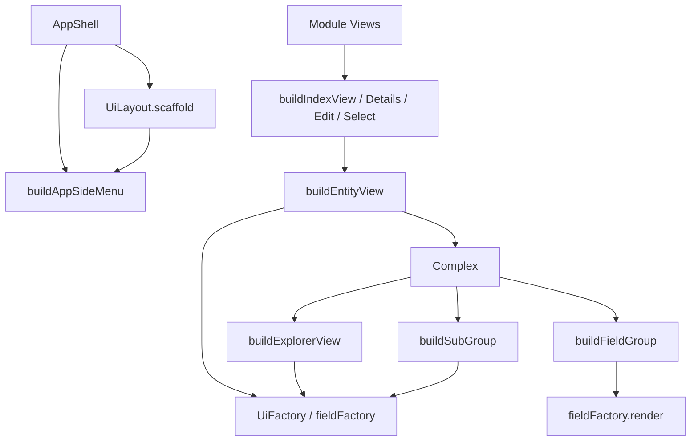

# UI 四职重构设计

产品分层仍是 **UI → Logic → Data**（[ARCHITECTURE.md](../../../../ARCHITECTURE.md)）。程序员用法见 [ui_four_roles_usage.md](./ui_four_roles_usage.md)。契约源码：[`builder.ts`](../../src/ui/builder.ts)、[`field_factory.ts`](../../src/ui/field_factory.ts)、[`factory.ts`](../../src/ui/factory.ts)、[`layout.ts`](../../src/ui/layout.ts)。

旧弹层 / 应用壳对照仍见 [refactor_ui_app.md](../refactor_ui_app.md)；本文只记 **layout / fieldFactory / factory / builder** 四职拆分。

## 为什么改

旧习惯把「排布局、画字段、造控件、拼整页」全塞进 `UiBuilder`：

| 问题 | 后果 |
|---|---|
| `buildTable` / `buildPaginator` / `buildContainer` 等薄包 | Builder 面爆炸；与 `factory.*` 重复 |
| `buildField` 兼标签行 + 选 editor | 单元格误走带标签路径；皮肤难共享 |
| `buildAppScaffold` / `buildContainer*` 在 Builder | 壳与页内排法本属 layout |
| `buildListView` / `buildGridView` 再包一层 | Index 实际只需 toolbar + factory.table|grid + paginator |
| `fieldFactory.timeline` | 时间轴是 chrome/整页，不是单字段 |

目标：Builder **只拼多块组合**；一个 `factory.x()` 或一层 DOM 能完成的，不进 Builder。

## 四职

| 职 | 契约 | 干什么 | 不干什么 |
|---|---|---|---|
| **layout** | `UiLayout` | 怎么排：App 壳、`layoutPage`、字段行/组、cell/row/column/grid | 不画业务控件、不按 editor 选组件 |
| **fieldFactory** | `UiFieldFactory` | 一个 `MetaUiField`：`render` / `editFor` / `displayFor` + 具名 renderer | 不拼整页、不拼组 |
| **factory** | `UiFactory` | 一个 chrome 控件：`table` / `button` / `sidebar`… | 不认会话 view、不拼工具栏+表 |
| **builder** | `UiBuilder` | 组装：模块 *View、SideMenu、登录/注册、字段组、Explorer；Overlay | 不 `h('div')`、不薄包单个 factory、无 `buildField` |

会话弹层（`toast` / `message` / `confirm` / `dialog`）算组装入口，留在 Builder。



## 调用链（目标）

```text
AppShell
  UiLayout.scaffold
    nav ← buildAppSideMenu → factory.sidebar | drawer
    page ← RouterView

Entity 路由 / context.select
  buildIndexView | buildSelectView | buildDetailsView | buildEditView
    → buildEntityView
         many → buildModuleToolbar + factory.table|grid|list|treeGrid + factory.paginator
                 （categoryList → buildExplorerView）
                 （gantt/timeline/… → buildXxxView，插件未装则 throw）
         one  → 扫 metaUi.groups
                  many ? buildSubGroup → factory.grid|treeGrid
                       : buildFieldGroup → fieldFactory.render（内含 layoutField）
```

登录路由：页内 `ui.buildSigninForm(...)`（不要 `factory.signinForm`）。

## Builder 表面（整理后）

### Overlay（会话，不是控件）

`toast` · `message` · `confirm` · `dialog`

### App

- `buildAppSideMenu` — 只产 nav 槽内容
- `buildSigninForm` / `buildSignupForm` — 登录 / 注册表单
- 壳本身 → **`UiLayout.scaffold`**（不是 Builder）

### Module

`buildIndexView` · `buildSelectView` · `buildDetailsView` · `buildEditView` · `buildEntityView` · `buildModuleToolbar`

### Module / 插件页（可选）

`buildGanttView` · `buildTimelineView` · `buildSchedulerView` · `buildKanbanView` · `buildDiagramView`

- **进 Builder、不进 UiFactory**
- 未 `setXxxPlugin` 时方法 **throw**（与现有 `GANTT_PLUGIN_NOT_INSTALLED` 同款），不要 silently 空 `div`

### 复杂组件

`buildExplorerView` · `buildFieldGroup` · `buildSubGroup`

### 明确不进 Builder

| 旧 | 新 |
|---|---|
| `buildTable` / `buildGrid` / `buildList` / `buildPaginator` / `buildTree` | `factory.*` |
| `buildListView` / `buildTableView` / `buildGridView` / `buildTreeGridView` | Index 内直接拼 factory + toolbar |
| `buildContainer` / `buildHeader` / `buildMain` / `buildFooter` / `buildAside` | 仍走 Builder（列表等还在用） |
| `buildAppScaffold` | `UiLayout.scaffold` |
| `buildField` | `fieldFactory.render`（或 `editFor` / `displayFor`） |
| `buildCustomView` | 插件 `resolveCustomView`（整页覆盖） |

## fieldFactory 三入口

| 方法 | 何时 | 元数据没配时 |
|---|---|---|
| **`render(field, context)`** | 自动：`editing && !readonly` → 编辑，否则显示 | 同下 |
| **`editFor`** | 程序员强制编辑 | `customEditor` ?? `field.editor` ?? **`fallbackInput`** |
| **`displayFor`** | 程序员强制只读 | `customRenderer` ?? `field.renderer`（bool 默认 `checkedIcon`）?? **`fallbackDisplay`** |

三者都套默认 `layout.layoutField`（标签 + 控件 + 可选校验文案）。

- `buildFieldGroup` 与自定义屏默认 **`render`**
- **具名 renderer 仍是裸控件**；表格单元格用具名方法，**不要**走这三条（会带标签）
- **没有** `fieldFactory.timeline`：时间轴走 `factory.timeline` / `buildTimelineView`

vui 构造 Builder 时 `attachFieldRowApi(fieldFactory, layout)` 挂上三入口并注入 `layout`。

## layout 两层

| 接口 | 范围 |
|---|---|
| **`UiLayout`** | 页内：`layoutField` / `layoutFieldGroup` / `layoutPage` / cell·row·column·grid；应用壳 `scaffold` |
| **`UiAppLayout`** | 应用壳：`scaffold({ variant, topBar, nav, page, bottomBar })`；变体 `sidebarLeft` \| `topBarFull` |

`AbstractUiLayout` 提供页内默认实现；vui `VueUiLayout` 落地（含 scaffold）。

## factory 增补（本轮）

- 本轮**不砍**已有 chrome 方法；Builder 薄包改调这里
- 登录 / 注册走 **`buildSigninForm` / `buildSignupForm`**，不进 `UiFactory`
- 数据区：`list` / `table` / `grid` / `treeGrid` / `tree` / `paginator` 供 Index 直调
- 壳控件：`sidebar` / `drawer` 供 `buildAppSideMenu` 内用

## 迁移对照（程序员）

| 旧写法 | 新写法 |
|---|---|
| `ui.buildField(field, ctx)` | `ui.fieldFactory.render(field, ctx)` |
| `ui.editFor` / `displayFor`（裸控件） | 裸控件 → 具名 `fieldFactory.textInput` 等；带行 → `fieldFactory.editFor` / `displayFor` |
| `ui.buildTable(rows, meta, props)` | `ui.factory.table(rows, meta, props)` |
| `ui.buildContainer([...])` | 仍 `ui.buildContainer([...])` |
| `ui.buildAppScaffold({...})` | `layout.scaffold({...})` |
| `ui.buildTreeListView` | `ui.buildExplorerView` |
| `ui.buildView` | `ui.buildEntityView` |
| `ui.buildGroup`（主+子） | `buildFieldGroup` / `buildSubGroup` 分开 |

皮肤侧：登录 / 注册在 Builder 实现（`h(SigninForm, …)`），不要挂到 `factory`。

## 非目标（本轮不做）

- 不删 `UiFactory` 上已有大量 chrome 方法面
- 不把甘特/看板等插件方法搬进 `UiFactory`
- 不改 Logic / Data 分层；Logic 仍只认 `context.uiBuilder`（类型为 core `UiBuilder`）
- 不在 `@mmda/vui` 再声明与 core 同名的 `interface UiFactory`

## 相关文档

| 文档 | 内容 |
|---|---|
| [ui_four_roles_usage.md](./ui_four_roles_usage.md) | 程序员怎么写 |
| [ui.md](../ui.md) | core `src/ui/` 总览（已对齐四职） |
| [layout.md](./layout.md) | 布局契约要点 |
| [ui_builder_usage.md](./ui_builder_usage.md) | 旧用法入口（指向本文） |
| [vui builder.md](../../../vui/docs/builder.md) | vui / 皮肤实现侧 |
