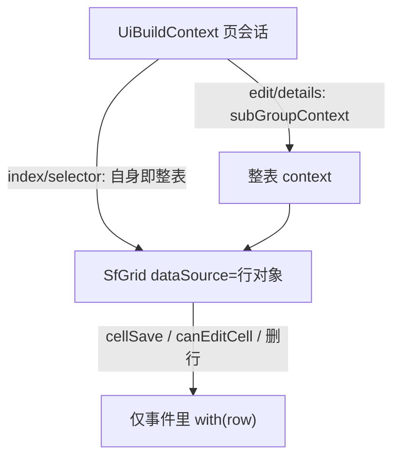
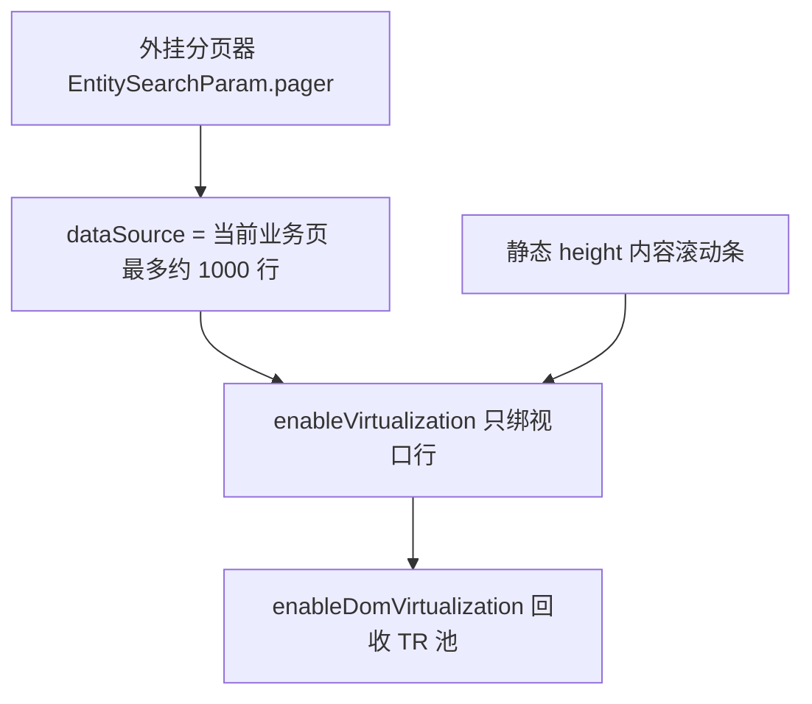
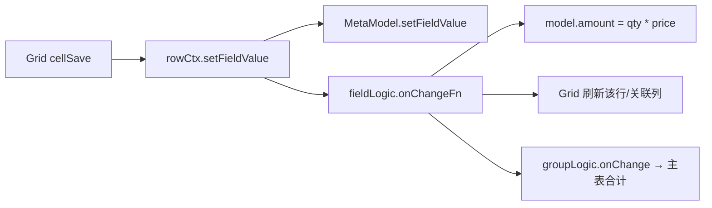
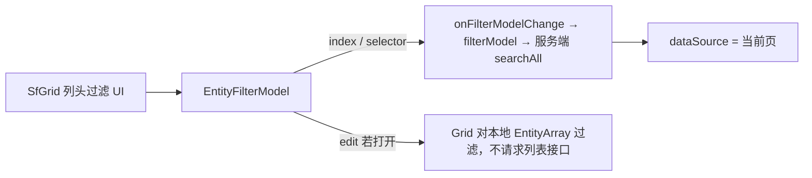

# SfGrid 设计（Syncfusion 皮肤实现笔记）

**对外接口是厂商无关的。** 业务与 Builder 只读 [sf-grid.md](./sf-grid.md)。本文记录本包如何把那份契约落到 EJ2（模块、editType、Predicate 映射、导出栈等），**不是**第二份 API。AgGrid 包装层应对齐契约，不必对齐本文细节。

控件：`[packages/vui-syncfusion/src/components/SfGrid.ts](packages/vui-syncfusion/src/components/SfGrid.ts)`（`sfGridColumn` 同文件）。

## 备注说明

SfGrid 是皮肤控件：`metaui` + `dataSource`（行对象）+ `scene` + 事件。**不持有 UiContext**，也不把 context 塞进 `dataSource`。本轮不改 `factory.table`；日后 `factory.grid` → 皮肤表格。现在可直接 `h(SfGrid, …)`。

**现有调用链（对照，本轮不动）**

```text
Index / Selector
  build() → buildListView → listViewParts → buildTable
    → tableWithCells(rows, metaui, () => pageContext)   // 页 = 整表，禁止 with(row)
    → factory.table

Edit / Details 子表
  build() → buildView → buildGroup(many)
    → groupCtx = page.subGroupContext(group)            // 整表 = EntityArray
    → tableWithCells(rows, group.groupUi, row =>
         readOnly ? groupCtx : groupCtx.with(row))      // 现编辑子表会预建行会话；SfGrid 改为只在事件里 with
    → factory.table
```

**目标调用链**

```text
Index / Selector
  buildListView → buildTable → factory.grid(scene=index|selector)
    → SfGrid；过滤/排序/选中写回页 searchParam / selectedItems

Edit / Details 子表
  buildGroup → subGroupContext(group) → factory.grid(scene=edit|details)
    → SfGrid；dataSource = 行对象
    → 仅 cellSave / canEditCell / 删行：groupCtx.with(row)
    → 对话框：页 subGroupItem / newSubGroupItem（不是 with）
```



三层：页（`UiBuildContext`）→ 整表（index 即页；子表 `subGroupContext`）→ 行（`with(row)`，缓存 `@row/{id}`）。index / selector / details 渲染禁止 `with(row)`；edit 禁止列模板预建，只在回调里按需 `with`。细则见后文「调用路径与 Context」。

- 不抽、不改 `factory.table` / `factory/utils` / 现有 `factory/grid.ts`
- 官方 Grid 模块 `provide`（**不含 ColumnChooser**）；**scene 只改默认开关**，显式 props 可覆盖
- 用语：**UI 层叫 Layout**（列宽、列序、显隐、冻结）；**数据层叫 MetaUi**（写回的就是 `metaui` 上对应字段）。不叫 Pack。
- 四种 scene 默认 `allowResizing` + `allowReordering`。Layout 回写只改 MetaUi 的 `listSize` / `listPos` / `listed` / `frozen`，**不顺带过滤器、排序**。**index / selector / details 默认回写 Layout**；**edit 默认不回写**。`persistLayout` 覆盖。
- **过滤、排序是否回写 MetaUi**：`persistFilter` / `persistSort` 仅 **index / selector** 默认开。edit 不排序；details 客户端排序不回写。
- 列显隐不用 ColumnChooser。伴侣 `[SfGridLayout](packages/vui-syncfusion/src/components/SfGridLayout.ts)`：**能力默认开、可关**。**表格上不画布局按钮**；四种 scene 都由页面外挂菜单/按钮调用 `open`。与 Grid 共用同一份 MetaUi。SfGrid **不提供** `showColumnChooser`
- 主参数：`metaui`、`dataSource`、`scene`
- **SfGrid 不持有 UiContext**。整表 / 每行 context 由 vui Builder 管；Grid 只吃行对象 + 回调。调用路径与分层见下章

`scene: 'index' | 'selector' | 'edit' | 'details'`。显式 props 覆盖默认。公共列规则见文末。


|              | index                                                                                 | selector     | edit                                     | details                           |
| ------------ | ------------------------------------------------------------------------------------- | ------------ | ---------------------------------------- | --------------------------------- |
| `editable`   | false                                                                                 | false        | true（就地，`editSettings.mode` 默认 Cell）     | false                             |
| 分页           | **外挂分页器**（Grid 不开 `allowPaging`）                                                      | 同 index      | 默认关                                      | 默认关                               |
| 虚拟滚动         | 开；静态 height + 官方 scrolling/virt                                                       | 同 index      | 默认关，行多可开                                 | 同 edit                            |
| 排序           | **服务端**多列（Ctrl+点列头）；列跟 `field.sortable`                                               | 同 index      | **默认关**                                  | **客户端**多列（真正用 SfGrid 排序）          |
| 过滤           | 开；**服务端 EntityFilterModel**                                                           | 同 index      | 默认关；若开则**客户端**                           | 默认关                               |
| 选择           | **单行**                                                                                | **single     | multiple**（传参）                           | **单元格**（配合 Cell 就地编）              |
| 操作列          | **命令列**（右冻结）承载 rowMenu                                                                | 默认同 index，可关 | **命令列**右冻结，默认删行                          | 默认无                               |
| Layout（列宽/序） | Resize + Reorder，**默认写回 MetaUi**                                                      | 同 index      | Resize + Reorder，**默认不写回**               | Resize + Reorder，**默认写回 MetaUi**  |
| Layout（显隐）   | **SfGridLayout** 能力默认开，可关；**按钮在表格外**                                                  | 同左           | 同左                                       | 同左                                |
| 自动列宽         | 能力默认开；**外挂菜单调用** `autoFitColumns()`，不每次绑定自动跑                                          | 同左，可关        | 同左                                       | 同左                                |
| 过滤/排序回写      | `persistFilter` / `persistSort` 默认开                                                   | 同 index，可关   | 无                                        | 客户端排序**不回写**                      |
| 性能           | **对齐官方 [performance](https://ej2.syncfusion.com/vue/documentation/grid/performance)** | 默认同 index    | 不以此为先                                    | 同 edit                            |
| 合计           | **默认关**。`aggregationSet` 是服务端总计（位标记），本页 footer 不默认开；未来做全库合计                           | 同 index      | 子表 `aggregates` + EntityArray；可 `=>主表字段` | footer；`defaultGroupBy` 则 caption |
| 主从表          | `hierarchyMode`: default / lazy / eager                                               | 默认不展开        | 不适用                                      | 不适用                               |


四种 scene 分述如下。

## 1. `index`

列表页：只读、当前页数据量大、服务端查询。**性能优先**，对齐官方 [performance](https://ej2.syncfusion.com/vue/documentation/grid/performance)、[scrolling](https://ej2.syncfusion.com/vue/documentation/grid/scrolling/scrolling)、[virtual scroll](https://ej2.syncfusion.com/vue/documentation/grid/scrolling/virtual-scroll)，能遵守的都遵守。

- `editable: false`，无 `editSettings`，列不可编

**滚动与虚拟滚动（index 可靠方案）**

三篇一起看：[Scrolling](https://ej2.syncfusion.com/vue/documentation/grid/scrolling/scrolling)、[Virtual scrolling](https://ej2.syncfusion.com/vue/documentation/grid/scrolling/virtual-scroll)、[DOM virtualization](https://ej2.syncfusion.com/vue/documentation/grid/scrolling/dom-virtualization)。**不要**用 EJ2 `UrlAdaptor` 边滚边 skip 拉全库；也不要把 Grid `allowPaging` 当业务分页。

分层（从上到下）：




1. **Scrolling 视口**：Grid 必须有**静态 `height`**（或父容器静态高度 + `height: '100%'`）。否则没有内容滚动条，后面两层都不生效。列宽像素（`listSize`），超出出横向滚动。设明确 `rowHeight`（如 36），行高一致、不换行。
2. **业务分页 = 官方「浏览器高度上限」的分段方案**：virt 用 `count * rowHeight` 算内容高；百万行会顶满浏览器（官方 virtual-scroll 文末）。我们 **dataSource 只有当前业务页**，内容高 = 本页行数 × 行高，远低于上限。外挂 Pager 换页 = 换一段数据。不采用官方 Solution 3（Grid 自带 Page，与 row virt 不兼容）。
3. **Row virtualization（`enableVirtualization`）**：注入 `VirtualScroll`。只渲视口行。`pageSettings.pageSize` = 视口行数 + 缓冲（现有 `VIRTUAL_ROW_PAGE_SIZE` 约 50），**不是**业务 pageSize。`**allowPaging: false`**。**默认不开** Infinite scrolling（与 row virt 官方不兼容，见下节开关）。
4. **DOM virtualization（`enableDomVirtualization`）**：注入 `DomVirtualization`。在 1+3 之上回收固定 DOM 池（官方 demo 与 row virt 同时开）。`domVirtualizationSettings`：`autoRowHeight: false`（变行高会关掉列虚拟化且打乱高度计算）；`rowBuffer` 用默认（约 5）；不必为 index 开 `autoRowHeight`。
5. **Column virtualization（按需）**：列出列较多再开。列宽必须 **px**。与 Page / Group / Stacked header / Row·Detail template / **Hierarchy** / Batch 不兼容。**lazy 主从展开时关行虚拟化**（见主从表）。eager 是扁平行不是 Hierarchy，仍可用 virt。单元格选择两种 virt 都不支持 → index 只用**行选**。

**禁止叠在 index virt 上**：detail/row template、**lazy 嵌套子表**、batch、text wrap、单元格选择、Grid Page。

**远程数据**：过滤/排序/换页只走 `EntityFilterModel` + `pager` 换 `dataSource`。不要再给 Grid 配 DataManager 滚动加载，避免双重 skip。

selector 同一套。edit/details 默认关 virt（本地行少；若打开须同样静态 height + 行高一致，且 **edit 的 Cell 选择与 row virt 官方不兼容**，故子表就地编不要开行虚拟化）。

**无限滚动（开关，后续能力）**

官方：[Infinite scroll](https://ej2.syncfusion.com/vue/documentation/grid/scrolling/infinite-scroll)。滚到内容底再要下一块数据，必须静态 `height`；与 **Row virtualization、Grid Page、row template 等不兼容**。

- index **默认**仍是：外挂分页 + `enableVirtualization` + `enableDomVirtualization`
- 预留开关（如 `scrollMode: 'virtual' | 'infinite'`，默认 `'virtual'`）。本轮可只接线、不实现 infinite 加载
- 打开 infinite 时：**关** row virt / DOM virt / 外挂 Pager；注入 `InfiniteScroll`；`enableInfiniteScrolling: true`；`pageSettings.pageSize` 作每块条数；滚到底 → 下一页 `searchAll`，**追加** `dataSource`（不要换成 Grid `allowPaging`）
- 过滤/排序仍走 `EntityFilterModel`；条件变化须**清空已加载块再从第一块拉**
- 与 virt 一样：行选、行高一致、不用单元格选

其余性能：

- **不要**给数据列挂 Vue `template` / `queryCellInfo` / `rowDataBound` 做显示；用 `field` + format / `valueAccessor`。自定义单元格优先官方 column template，且尽量只给操作列
- `enableHover: false`（文档：减少每行 hover 开销）
- 合计默认关；少 `refresh()`。**不要**每次绑定后 `autoFitColumns`（官方性能：autoFit 贵）。自动列宽只作为工具栏动作，见下
- `allowSorting: true`，详见 **表格排序**（服务端多列，Ctrl+点列头）
- `allowFiltering: true`，详见 **表格过滤**（模型是 AG 风格 `EntityFilterModel`，index 走服务端）
- **选择：单行**（`selectionSettings.type: 'Single'`，`mode: 'Row'`）；点行高亮，无勾选列
- 操作列：优先 **命令列右冻结**（见表格编辑），行为仍接框架 action；可关
- `allowResizing`、`allowReordering` 开
- 列显隐不走 ColumnChooser。**表格内不放「表格设置 / 自动列宽」按钮**；index 工具栏（或任意外挂菜单）调 `SfGridLayout.open` / `autoFitColumns()`。能力默认开，可关
- **自动列宽**：四种 scene **默认都有**（元数据列宽难配准时一键量完）。SfGrid `autoFitColumns()` → EJ2 `autoFitColumns`，把 px 写回 MetaUi `listSize`。**不跟 `persistLayout` 走**：edit 拖列默认不回写，但点自动列宽仍写 `listSize`。解析 `180px`，不能 `Number('180px')`。不在每次绑定后跑
- Layout：Grid 上拖列宽/换列序 → 写回 **MetaUi**。显隐/冻结/列序对话框 → **SfGridLayout** 写同一份 MetaUi。`persistLayout` 默认 true
- 过滤、排序：查询照常；是否写回 MetaUi 用 `**persistFilter` / `persistSort` 分开控制**（与 Layout 无关）。默认开，调用方关掉即可
- 主从表：`hierarchyMode: 'default' | 'lazy' | 'eager'`，见 **主从表**
- 不为每行建 context

provide 仍可注册模块全集（scene 切换不拆包）；index **运行时**按上面关掉或不用的能力，不把 edit/details 的模板和事件套到列表上。

## 2. `selector`

选记录（弹窗选关联等）。**默认能力与 index 相同**（含性能策略：虚拟滚动、外挂分页、排序、过滤、Resize/Reorder、自动列宽、SfGridLayout、操作列）。特殊点只有选择。

- **选择**：`selectionMode: 'single' | 'multiple'`（默认 `multiple`）；多行勾选列，单行点选
- 对外暴露 `**selectedItems**`（当前选中行），不负责写回主表字段
- index 侧能力（操作列、右键 `rowMenu`、自动列宽、SfGridLayout、临时新增/编辑/删除）**默认开，可用传参关掉**。关掉编辑、只做选择时 **不要** 行上下文菜单。允许编辑时右键 **跟 index 一样**
- Layout 写回 MetaUi 同 index（默认开）
- 过滤、排序写回 **默认同 index**（`persistFilter` / `persistSort`），可关
- 合计默认关，可传参开（同 index）

## 3. `edit`

编辑页子表（及日后 `factory.grid`）：就地改行、数据一般已在本地。详见下方 **表格编辑**。

- `editable: true`，`editSettings.mode` 默认 `**Cell**`（inplaceEdit，像 Excel）
- **选择：单元格**（`selectionSettings.mode: 'Cell'`），与就地编同一套点击
- `field.primaryKey` → `isPrimaryKey`；表/字段 `readOnly` 优先不可编；`inPlaceEdit(false)` 只关就地，不关对话框编辑
- 默认：不分页、不排序、不过滤
- **命令列右冻结**，默认删除（`confirmDelete` 可开）；不靠命令列进编格
- 对话框编辑走实体 edit 视图（`subGroupItem` / `newSubGroupItem`），不用 EJ2 Dialog 表单
- 新增行：MetaModel/EntityArray 默认值 + `sequenceKey`（如 itemID）唯一
- `allowResizing`、`allowReordering` 开；**拖列 Layout 默认不写回 MetaUi**。可传 `persistLayout: true`。**自动列宽、SfGridLayout 默认开**（点确认仍写 MetaUi）
- 无 ColumnChooser
- 虚拟滚动默认关，行很多时可 props 打开
- 合计：有 `aggregationSet` / `aggregates` 则 footer；数字走 **EntityArray.sum/count**（跳过 `entityState` 已删）。`SUM(amount)=>totalPrice` 可写主表。默认**不分组**
- 行 context 不进 `dataSource`；只在进格/保存事件里 `with(row)`（见 **调用路径与 Context**）

## 4. `details`

详情页子表：只看、结构与 edit 接近。

- `editable: false`，无 `editSettings`
- **选择：默认无**（`allowSelection: false`）；可传参开「自由」点选行，不配勾选列
- 默认：不分页、不过滤、无操作列；**允许客户端排序**（见表格排序）
- `allowResizing`、`allowReordering` 开；**Layout 默认写回 MetaUi**（同 index，不含过滤/排序）。**自动列宽、SfGridLayout 默认开**
- 无 ColumnChooser
- 虚拟滚动默认关
- 合计：footer 同元数据；有 `**defaultGroupBy**` 则按该列分组 + caption 合计（无 dropArea）。通常不写回主表
- 不为每行建 context

## 调用路径与 Context

分层、何时 `with(row)`、Builder 回调见文首 **备注说明**。此处只补判定档和回调清单。

| 层 | 怎么拿 | `model` 是什么 | 干什么 |
|---|---|---|---|
| **页** | `UiBuildContext` | Index = 分页列表包装；Edit/Details = 主表实体 | `search`、主表保存、打开 `subGroupItem` 对话框 |
| **整表** | index/selector：**就是页**；子表：`page.subGroupContext(group)`（按 `cachePath/groupName` 缓存一份） | 子表 **EntityArray** | 列元数据、`groupLogic`、组级只读/隐藏、增行 `addSubGroupItem`、合计 `sum/count`、`onAggregatesChange` |
| **行** | `tableCtx.with(row)`（缓存 `@row/{id}`）；对话框另用 `subGroupItemContext` | **这一行** | `setFieldValue`、`validateField`、`fieldLogic.onChange`、行级 `isFieldReadonly` / `canEditCell` |

`with(row)` ≠ 对话框。`subGroupItem` / `newSubGroupItem` 才是实体 edit 视图。`beginEdit` / `endEdit` 就是 `with` / `release`。

**Logic 定义**（`fieldLogic` / `groupLogic`）可共享；校验树和 `FieldSearchOptions` **不**跨实例共享。

### 谁允许建行 Context

| scene | 渲染时 | 事件时 |
|---|---|---|
| **index / selector** | **禁止** `with(row)`。`buildTable` 已是 `() => context`。千行 + virt 不能为每行建会话。行菜单只用 `row` 上的 `editable`/`deletable`/`id` + 页上的 `getModuleAuth(row)` | 一般仍禁止。不要为了显示单元格去 `with` |
| **details** | **禁止**。整表用 `subGroupContext`，只读。客户端排序/合计走 EntityArray，不需要行会话 | 不需要。打开单据仍走页级导航，不是子表行 context |
| **edit** | **禁止在列模板里预建**。不要 `rowContext(row)` 进每个 Vue cell（现 `tableWithCells` 编辑子表会这样，SfGrid 要改掉） | **按需**：`cellEdit` / `cellSave` / `canEditCell` / 命令删行 → `groupCtx.with(item)`；离格后可 `release`。对话框编辑用 `subGroupItemContext`，不是 `with` |

判定「列能不能编」分两档，避免千次 `with`：

1. **整表即可**：`group.readOnly`、`field.readOnly`、`groupLogic.inPlaceEdit`、`fieldLogic.inPlaceEdit(false)`、`groupCtx.isFieldReadonly(field)`（不依赖当前行）→ 配 `allowEditing` / `editableFields`。
2. **必须行**：`row.editable === false`、`readonlyFn` / `allowOps` 等 → 只在 `canEditCell(row, field)` 里 `with(row)`。

`row.editable` / `row.deletable` 是行数据上的旗，命令列/菜单直接读，不必为了藏按钮先建 context。

### SfGrid 对 Builder 的回调（context 在闭包外）

Grid 只认行对象。Builder 闭包住 `groupCtx` 或页 `context`：

- `onCellSave(row, field, value)` → `with(row).setFieldValue` → 刷新该行
- `canEditCell(row, field)` → 必要时 `with(row)`
- `onAdd` / `onDelete(row)` → 整表 `addSubGroupItem` / `deleteItem`；确认后刷 footer
- `onOpenEdit(row)` → 页 `subGroupItem(group, row)`
- `onFilterModelChange` / `onSort` → 页 `searchParam`（index）或整表本地滤（edit 若打开）
- `onSelect` → 页或整表 `selectedItems`

**不要**把 `rowContext` 函数传进 SfGrid 当列 body。数据列走 EJ2 `field` + format；操作列用命令列，不要 Vue 逐行模板。

## 表格编辑

官方总览：[Editing](https://ej2.syncfusion.com/vue/documentation/grid/editing/edit)。对应框架用语：**就地编辑 = inplaceEdit**（像 Excel）；**对话框编辑 = 打开实体 edit 视图**（不是 EJ2 自绘表单）。

`scene === 'edit'` 默认就地；index / selector / details 默认不可编。主键列：`field.primaryKey` → `isPrimaryKey`（官方硬条件）。

### Cell 与 Inline 的关系（取舍）


| 官方 `editSettings.mode`                                                                                   | 行为                  | 我们                        |
| -------------------------------------------------------------------------------------------------------- | ------------------- | ------------------------- |
| **Cell**（[cell-editing](https://ej2.syncfusion.com/vue/documentation/grid/editing/cell-editing)）         | 点一格编一格，像 Excel      | **默认 = inplaceEdit**      |
| **Normal**（[in-line-editing](https://ej2.syncfusion.com/vue/documentation/grid/editing/in-line-editing)） | 整行进编辑，要 Save/Cancel | 不用作默认；文档里「改 A 更新 B」的钩子仍参考 |
| Batch                                                                                                    | 多格暂存再一次提交           | 本轮不做                      |


结论：要的「单元格就地编辑」就是官方 **Cell**，不是整行 Inline。`groupLogic.inplaceEdit` / `inplaceEditStart`（`excel`  `click`  `dblclick`）映射到 Cell 的进入方式。

### 列编辑类型

[edit-types](https://ej2.syncfusion.com/vue/documentation/grid/editing/edit-types)。**enum / ref / hasOne 优先于 SQL 类型**。`sfGridColumn` 四种 scene 共用；仅 `scene === 'edit'` 真正进格。


| 条件                  | `editType`                                                    |
| ------------------- | ------------------------------------------------------------- |
| enum / ref / hasOne | `dropdownedit`，`edit.params` 用 `valueOf`/`labelOf`，不用 EJ2 外键列 |
| 布尔                  | `booleanedit` + `displayAsCheckBox`                           |
| 日期时间                | `datetimepickeredit`                                          |
| 日期                  | `datepickeredit`                                              |
| 数值（非引用）             | `numericedit`                                                 |
| 其它                  | `stringedit`                                                  |


字段 `editType` 始终按上表配置（只读列也要正确显示）。**能不能编**不看 `inPlaceEdit`，看下一节。

### 谁能编辑（元数据优先）

列能否给用户改，先看 **MetaUi**，再看 Logic 的就地开关：

1. **表级**：`MetaUiGroup.readOnly` / `MetaUiSubGroup.readOnly` 为 true → 整表不能编（就地、对话框都不行）
2. **字段级**：`MetaUiField.readOnly` 为 true → 该列不是用户可编辑字段（优先；就地、对话框都不行）
3. **就地开关**：`groupLogic.inPlaceEdit` / `fieldLogic.inPlaceEdit(false)` **只关就地编辑**，不表示字段不可编。关了就地点格进不了 Cell，仍可走实体 edit 对话框（若元数据允许）

运行时再叠加行标志和 `canEditCell`。元数据已只读的列，`allowEditing: false`，不必进 `canEditCell`。

**行级 `editable` / `deletable`**：每行数据上都有。缺省视为允许（`!== false`）。Logic 可按状态关掉（如已占用 `item.editable = false`）。

- `row.editable === false`：该行不能就地编、不能开实体编辑；编辑类按钮/菜单 **不展示或 disabled**（所有 UI：命令列、行菜单、工具栏对当前行的操作）
- `row.deletable === false`：该行不能删；删除按钮/菜单 **不展示或 disabled**
- 不允许的动作不得可点；不能只藏命令列、别处菜单还能删/改

### 就地编辑（默认，`scene: edit`）

对齐 [in-line-editing](https://ej2.syncfusion.com/vue/documentation/grid/editing/in-line-editing) 里的计算/条件能力，但模式用 **Cell**。

**关联计算（数量 × 单价 = 金额）——Logic 怎么绑进来**

不在 SfGrid 里写公式。链路与现子表一致：




1. 业务在 `*Logic` 里：`this.field('quantity').onChange(...)` / `this.field('price').onChange(...)` 改 `model.amount`（见现有 MaintenanceLogic 等）。
2. SfGrid：`cellSave` → 归一化值 → `onCellSave` / `setFieldValue`（触发上面的 `onChangeFn`）。
3. Logic 改完同行其它字段后，SfGrid **刷新该行**（或 `setCellValue` 关联列），用户立刻看到金额变。
4. 组级合计：优先组 `aggregates` 的 `SUM(x)=>主表字段`（少写程序）；复杂仍用 `groupLogic.onChange`。footer 变化走 `onAggregatesChange`。

**条件编辑**：元数据已允许编、且 `row.editable !== false` 的列，`cellEdit` 里若 `canEditCell(row, field) === false` 则 `args.cancel`。由 Builder 闭包 `groupCtx`，**仅在该回调**里 `with(row)`（见调用路径）。`row.editable === false` 时整行进不了格。

**新增行默认值 + 行项次唯一**：不自己造号。走 `[MetaModel.createSubGroupItems` / `EntityArray](packages/core/src/models/metamodel.ts)`：`defaultVal`、`sequenceKey`（如 `itemID`）自增、`joinFields`、`rowNum`。本轮只 **末尾追加**（`addSubGroupItem`）。**指定位置插入列为未来**（见表格排序）。

**删除确认**：`confirmDelete`（或等价）可开关；开则删前确认，关则直接 `EntityArray.deleteItem`（新建行 splice，已持久行软删隐藏）。

### 校验

官方：[Grid validation](https://ej2.syncfusion.com/vue/documentation/grid/editing/validation)（列上 `validationRules`：required / min / max / range / minLength / regex / custom…）。元数据：`MetaUiField.validationRules`（字符串）→ `validatorDescriptors`（`{ name, args[] }`）→ `FieldLogic.validators`。运行时权威在 `[validateField](packages/core/src/logic/validation.ts)`，表单对话框与就地编应走同一套。

**规则引擎**

- 解析：`Max(100);Range(0,100)` → `{ name: 'Max'|'Range', args }`
- 叠加不短路：`nullable`/`requiredFn`（引用 `requiredNonZero`）→ 元数据 validators → `onValidate`；有规则仍做必填
- `onValidate(fn, 'warning')` 写入 warning，不拦保存
- 就地保存调 `getFieldError`（仅 error）

**SfGrid 接法**

1. **权威在框架，不在 EJ2。** 不要把 `validationRules` 当 EJ2 配置的源。唯一入口：`rowCtx.validateField` / `getFieldError`。
2. **SfGrid 只负责拦保存和展示。** `cellSave`：先 `validateField`，有错则 `args.cancel = true` 并显示消息。
3. **可选投影（后做）。** 把简单规则投影到 `column.validationRules`；两套结果必须一致，以框架为准。
4. **对话框编辑**走实体 `validate()`（同一 `validateField`）。
5. **关联计算之后再验。** `onChange` 改了派生列，应对被改字段再 `validateField`。

### 对话框编辑（实体 edit 视图）

官方 [dialog-editing](https://ej2.syncfusion.com/vue/documentation/grid/editing/dialog-editing) / [template-editing](https://ej2.syncfusion.com/vue/documentation/grid/editing/template-editing) 是 **EJ2 自绘/模板表单**。

**取舍（推荐）**：不用 EJ2 Dialog/Template 当编辑 UI。我们已有完整实体 edit（校验、Logic、布局）。对齐官方「外部表单」思路：

- 改已有行：`context.subGroupItem(group, row)` → `buildView` 实体 edit → 确认后表格已绑同一对象，必要时 `refresh` 该行。
- 新增：`context.newSubGroupItem({ group, sequenceKey })`（内部已 `createSubGroupItems` + 默认值 + 唯一项次）→ 对话框 → 取消则从数组移除。
- SfGrid 暴露 `onOpenEdit` / `onAdd`（或双击行），由 builder/factory 接到上述 API；**不**设 `editSettings.mode: 'Dialog'`。

EJ2 Dialog/Template 文档只作「保存后如何反映到 Grid」参考，不嵌入其表单。

### 命令列（Command Column）

官方：[command-column-editing](https://ej2.syncfusion.com/vue/documentation/grid/editing/command-column-editing)。EJ2 示例是行内 Edit/Save/Cancel，**不是**我们子表默认交互。

**要什么**：命令列本身（原生按钮、可 `commands` 自定义）+ **冻结在右侧**（`freeze: 'Right'` / MetaUi `frozen: Right`）。


| scene                | 命令列                                                                               |
| -------------------- | --------------------------------------------------------------------------------- |
| **edit**             | 默认有；至少 **删除**；不靠命令列进就地编（仍点单元格）。可再挂「打开实体编辑」等                                       |
| **index / selector** | 用命令列承载现 `rowMenu` / `showActions`（详情/编辑/删除…），替代每行 Vue 模板按钮，更利虚拟滚动；命令行为仍调框架 action |
| **details**          | 默认无                                                                               |


命令列 / 行菜单必须看该行 `editable`、`deletable`：不允许则不渲染该项，或渲染为 disabled。index 详情等只读动作不受这两旗影响。

## 表格过滤

UI 壳参考官方 [Filtering](https://ej2.syncfusion.com/vue/documentation/grid/filtering/filtering)（Excel / CheckBox / Menu）。**对外模型不跟 EJ2 Predicate，跟 AG Grid FilterModel**。仓库已有 `[EntityFilterModel](packages/core/src/models/entity_search.ts)`（注释即「AG Grid 风格」）。AgGrid 适配见 `[ag_filter.ts](packages/vui-agnaive/src/ag_filter.ts)`。

### 模型（权威）

`EntitySearchParam.filterModel: EntityFilterModel` = `Record<fieldName, EntityFieldFilter>`。有 `filterModel` 时走 `searchAll` body；`queryParams` 仍只放分页、关键词、快捷筛。


| `filterType`               | 对应 AG                   | 字段                                  | 内容                                                                                             |
| -------------------------- | ----------------------- | ----------------------------------- | ---------------------------------------------------------------------------------------------- |
| `text` / `number` / `date` | Text/Number/Date Filter | `operator` + `value` + 可选 `valueTo` | 算子用框架大写：`EQ` `CONTAINS` `BETWEEN` `IS_NULL`…（AG 的 `equals`/`inRange` 只在适配层转换）                  |
| `set`                      | Set Filter              | `values` + `IN`/`NOT_IN`            | enum / ref / hasOne：**选项来自 `refOptions`，主键 `valueOf`，显示 `labelOf`**。禁止当前页 distinct、EJ2 外键列、猜字段 |
| `boolean`                  | 真/假/空                   | `value: boolean                     | null`                                                                                          |


每字段当前一条简单条件（没有 AG 的 `condition1`/`condition2` AND/OR）。复合条件本轮不做。

SfGrid 契约：`filterModel` + `onFilterModelChange(EntityFilterModel)`。Grid 内部 EJ2 条件必须 **双向映射** 成该模型，与 AgGrid 同一份。

### 客户端 vs 服务端（对齐 AG）

AG：Client-Side Row Model 在浏览器滤当前数据；Server-Side Row Model 把 `filterModel` 交给 `getRows`。我们按 scene 对应：




- **index / selector（服务端，默认开过滤）**：`dataSource` 只有当前页，**禁止**用 EJ2 对这一页再滤一遍当结果。改筛 → 发出模型 → 调用方写入 `searchParam.filterModel` 并查询。虚拟滚动只渲这一页。
- **edit（客户端，默认关过滤）**：数据已在 `EntityArray`。若打开过滤，按同一 `EntityFilterModel` 在本地滤（或 EJ2 本地 + 同步模型）。不打列表 search。
- **details**：默认不过滤。

`persistFilter` 只序列化 `EntityFilterModel`（及 meta 上对应 filters），与 Layout 分开。index / selector 默认开。

### 列头 UI（EJ2 实现，AG 体验）

不默认 FilterBar（每列一行输入，不像 AG）。对齐 AG 列菜单：

- 文本 / 数字 / 日期：Excel 或 Menu（含算子、区间 `BETWEEN`）
- enum / ref / hasOne：**CheckBox / Excel 多选** = AG Set Filter；选项 `loadReferenceOptions` → `refOptions`
- 布尔：三态或真/假

index 性能：过滤弹层按需加载选项；不要 `queryCellInfo` 拼筛选项。

## 表格排序

官方：[Sorting](https://ej2.syncfusion.com/vue/documentation/grid/sorting)。`allowMultiSorting: true`：单击改一列；**Ctrl+点列头** 追加/切换多列（ASC/DESC）。列是否可排跟 `field.sortable`。

写出的模型是已有的 `pager.sorts: { sortBy, sortOrder }[]`（`SortOrder.ASC|DESC`），不是 EJ2 内部结构。


| scene                | 开？      | 谁排序                                                                                             |
| -------------------- | ------- | ----------------------------------------------------------------------------------------------- |
| **index / selector** | 默认开     | **服务端**。列头只收集 sorts → 写入 `searchParam.pager.sorts` → 再查。`dataSource` 只有当前页，**禁止**让 Grid 对本页再排一遍 |
| **edit**             | **默认关** | 保持录入顺序（itemID/rowNum）。**插入行**（指定位置 `insertItem`、重排项次）麻烦，**列为未来**：本轮只在末尾 `addItem`               |
| **details**          | **默认开** | **客户端**。数据已在 `EntityArray`，这才是真正用 SfGrid 排序。不打列表接口。**不** `persistSort`                          |


`persistSort` 只对 index / selector（与 `persistFilter` 一样可关）。details 排完只留在本次会话。

enum/ref/hasOne 按 `valueOf` 的值排（提交键），不要按 label 猜字段。软删行不参与 details 可视顺序（已隐藏）。

**未来：edit 插入行。** `EntityArray.insertItem` 已有。要处理当前行前/后插入、`sequenceKey`/`rowNum` 是否重编号、软删行占位、合计刷新、与「不排序」的顺序承诺。未做之前默认关排序才有意义。

## 表格布局

UI 叫 **Layout**，数据写 **MetaUi**。不叫 Pack。过滤/排序不是 Layout，回写开关见序列化一节。

### SfGridLayout

现 index 工具栏「表格设置」从列表页拆出，成为 SfGrid 的伴侣控件：`[packages/vui-syncfusion/src/components/SfGridLayout.ts](packages/vui-syncfusion/src/components/SfGridLayout.ts)`。

- **不是** Grid 模块 / ColumnChooser / 表内工具栏。SfGrid 只管表
- 与 SfGrid **共用同一份 MetaUi**；确认后写 `listed` / `frozen` / `listPos`（及已有 `listSize`）
- 能力对齐现 `[ListSettingView](packages/vui/src/ui/components/ListSettingView.ts)`：拖排序、显隐、左/右冻结、永久保存、恢复默认 / 从库重载。新文件独立实现，不改现有 index 管线、不引用 `factory.table`
- 打开方式：`open(metaui)`（或等价 API）。**四种 scene 都由外挂菜单/按钮调出**，SfGrid 表体和表头都不放布局入口
- **能力默认开、可关**（关了则外挂入口不应再打开）
- 自动列宽是 SfGrid 方法 `autoFitColumns()`，同样由外挂菜单调用，不是 Layout 对话框里的一项，也不是 Grid 内置按钮
- 子表（edit / details）同样外挂入口：元数据列宽/显隐难配准时一键改。edit 仅 **拖列** 默认不回写（`persistLayout`）；SfGridLayout 确认、以及自动列宽，仍写 MetaUi

### 表格布局序列化

- **SfGrid**：Resize / Reorder → `listSize`、`listPos`（受 `persistLayout` 约束；edit 默认不写）
- **自动列宽**：四种 scene 点一下都写 `listSize`（不跟 edit 的 `persistLayout: false`）
- **SfGridLayout**：显隐 / 冻结 / 对话框内列序 → `listed`、`frozen`、`listPos`。默认开；确认即写，不跟 edit 拖列的 `persistLayout: false`

都只写 MetaUi 这些字段，不捆过滤/排序。

- **index / selector / details**：默认 `persistLayout: true`
- **edit**：默认 `persistLayout: false`
- 显式 `persistLayout` 覆盖

过滤、排序是另两块元数据，用 `persistFilter`、`persistSort` 决定是否写回。**仅 index / selector 默认开**。edit 不排序；details 客户端排序不回写。

本地缓存若仍由 vui context 刷盘，那是调用方的事；SfGrid / SfGridLayout 契约止于写 MetaUi。不引用 `factory/table.ts`。

## 表格导出 Excel（附加能力）

官方：[Excel exporting](https://ej2.syncfusion.com/vue/documentation/grid/excel-export/excel-exporting)。模块可注入 `ExcelExport`，**默认不提供入口**（外挂按钮才调）。本轮可不做 UI，只保留能力说明。

### 客户端 `excelExport()` 对我们几乎没意义（index）

它导出的是 **Grid 当前 `dataSource`**。index 的 dataSource 只有当前业务页，再叠加行虚拟化后 DOM 更少。导出「当前页」在 Web ERP 里几乎没人要：要的是 **当前过滤/排序下的全部命中行**（或按权限封顶的一批）。

若先 `searchAll` 把万级行拉进浏览器再塞给 `exportProperties.dataSource`：内存和主线程都会炸，和 index 性能目标相反。

**勉强有用的场景**：edit/details 子表（`EntityArray` 已在本地、行数有限）——外挂「导出本表」走客户端即可。selector 一般也不需要。

### 官方「服务端导出」对 Java 行不行？

**不能当现成方案用。** 文档里的 `serverExcelExport` 把 Grid 属性 POST 到服务器，服务端用 `**Syncfusion.EJ2.GridExport`（NuGet，C# / ASP.NET）** 的 `GridExcelExport` 生成文件。这是 .NET 专用助手，**没有对等的 Java GridExport**。Java 去反序列化 EJ2 `gridModel` 再自己画 xlsx，等于绑死一套 C# DTO，不划算。

Syncfusion 另有 **XlsIO for Java**（独立 Excel 引擎，要许可），那是「Java 里写 xlsx」，**不是** Grid 的 serverExcelExport。和 POI / EasyExcel 同类，与 SfGrid 无绑定。

### 建议

1. **index 导出不要走 EJ2。** 外挂「导出」按钮：把当前 `EntityFilterModel` + sorts 交给 **已有 Java `searchAll` 同条件** 的导出接口，服务端流式写 xlsx（自有栈即可）。列集用 MetaUi `listed` / `listPos` / `displayLabel`，与表格布局一致。
2. **SfGrid 仍注入 ExcelExport**（模块全集），只给子表等小数据可选调用；**不要**做成 index 默认工具栏。
3. 不要为了导出去关虚拟化或把全量数据塞进 Grid。

## 上下文菜单（附加能力）

官方：[Context menu](https://ej2.syncfusion.com/vue/documentation/grid/context-menu)。注入 `ContextMenu`。**不要**用官方默认项（Excel/Pdf/Csv、内置 Edit/Save 进 EJ2 整行编）。

- 数据源：现有 `rowMenu(row) → UiAction[]`（与命令列同一套框架 action）。右键行 → 弹出该行关联操作（详情、编辑、删除、业务命令…）
- 仍看 `editable` / `deletable` / 权限：不该出现的项不进菜单或 disabled
- **表格不内置菜单按钮**；有 `rowMenu` 才开 `contextMenuItems`。点菜单走 `contextMenuClick` → `action.onAction`，带上 `args.rowInfo.rowData`
- 表头右键：默认不提供（自动列宽走外挂，不跟官方 AutoFit 菜单绑死）


| scene              | 默认                                                       |
| ------------------ | -------------------------------------------------------- |
| **index**          | 有 `rowMenu` 则开                                           |
| **selector**       | **仅选择**（关掉临时增删改）则不开。允许编辑、与 index 同一套操作时 **跟 index 一样** 开 |
| **edit / details** | 默认关；可传 `rowMenu` 打开（例如删行、打开实体编辑）                         |


命令列仍可同时存在：常驻几个按钮，其余放右键，避免每行按钮过多（利 virt）。

## 合计

官方：[Aggregates](https://ej2.syncfusion.com/vue/documentation/grid/aggregates/aggregates)、[Footer](https://ej2.syncfusion.com/vue/documentation/grid/aggregates/footer-aggregate)、[Group/caption](https://ej2.syncfusion.com/vue/documentation/grid/aggregates/group-and-caption-aggregate)、[Reactive](https://ej2.syncfusion.com/vue/documentation/grid/aggregates/reactive-aggregate)、[Custom](https://ej2.syncfusion.com/vue/documentation/grid/aggregates/custom-aggregate)。

两套元数据不要混：


| 来源                               | 含义                                                                                    | 用在哪                                        |
| -------------------------------- | ------------------------------------------------------------------------------------- | ------------------------------------------ |
| `**MetaUiField.aggregationSet**` | MetaCol 位标记 Number：`NONE=0` `COUNT=1` `SUM=2` `AVG=4` `MIN=8` `MAX=16`，可组合（如 Sum+Avg） | **列表服务端总计**（查询命中的全集）。**不是**当前页 Grid footer |
| `**MetaUiSubGroup.aggregates**`  | 如 `SUM(amount)=>totalPrice`                                                           | **子表** footer / 写主表字段                      |


### 页脚合计

- **index / selector**：Grid footer **默认关**。`aggregationSet` 现在还没有「全库合计」UI；若打开 Grid 合计只能是**本页** `dataSource`，和位标记要的服务器总合计不是一回事，容易误导。**未来**做总计（pager/页脚另显服务端 totals）。本页合计若以后要开，须和总计并排标清，且默认仍关。
- **edit / details**：看 `**MetaUiSubGroup.aggregates`**（及子表字段需要展示的聚合），用 EntityArray 算 footer。
- **edit 的数字不信 EJ2 扫 dataSource。** 主从一次提交、删行只标 `entityState`。用 `[EntityArray](packages/core/src/models/metamodel.ts)` 的 `sum` / `count` / `min` / `max`。增删改后重算 → 刷 footer → 按 `=>` 写主表。
- `min`/`max` 应对齐跳过已删行（当前 collection 的 min/max 尚未 filter）。框架在调用 `aggregateFn` **之前**滤掉已删行，写程序的人**不必管 `isDeleted`**。
- 模板只格式化已算好的数。

### 分组（实验，场景有限）

官方 Group 拖到 dropArea 的下拉体验不好，**不作为 index 能力**（且与 row virt / Page 不兼容）。

有意义的主要是 **details 子表行多**：如报价按产品类别分组再合计。用组上 `**defaultGroupBy`**（字段名；若类型里还没有则补到 `MetaUiGroup`）→ `groupSettings.columns`，`**showDropArea: false`**。caption 用 `**MetaUiSubGroup.aggregates**` 同一套（仍走 EntityArray，跳过已删行）。

- **details**：有 `defaultGroupBy` 则开分组 + caption 合计
- **edit**：默认不开分组（就地 Cell + 分组一起很乱）；需要时再传
- **index / selector**：默认关
- 自定义 caption 模板：允许 `groupCaptionTemplate` / `captionTemplate` props

### 响应式合计 → 主表字段（少写程序）

报价：行 `amount = price * qty`（字段 `onChange`），footer 合计写入主表 `totalPrice`。主从 **整体保存**，删行是 `entityState` 标记，所以合计必须跟 CRUD 走同一套 **EntityArray**，不能只用 EJ2 reactive 扫当前可见行（已删行仍在数组里会被加进去，或被隐藏后 EJ2 计数不对）。

官方 [reactive-aggregate](https://ej2.syncfusion.com/vue/documentation/grid/aggregates/reactive-aggregate) 只适合 **触发时机**（改格后要重算）。**数值**一律：

`items.sum('amount')` / `items.count()`（内部已跳过删除）→ 显示 footer → `SUM(amount)=>totalPrice` 时写主表。

触发点：`cellSave`、`addItem`、`deleteItem`（软删）、撤销删除。EJ2 回调若要用，也只展示框架算出的数。

**能配就不写 rollup Logic：** 子表 `**MetaUiSubGroup.aggregates`**：`SUM(amount)=>totalPrice`（`=>` 后是**主表字段名**）。未写 `=>主表字段` 的只显示。复杂分摊、含税、加权仍用 Logic；Logic 调 `EntityArray.sum` 即可，**不要自己 filter isDeleted**（方法已排除）。

details 通常只展示，不写主表。

### 自定义合计（框架还不熟）

官方 custom aggregate：自己写函数扫行。建议分层：

1. **先做齐内置五类**（与位标记同一套 COUNT/SUM/AVG/MIN/MAX）+ `aggregates` 的 `=>主表字段`。
2. `**groupLogic.aggregateFn**`：框架先交出 **未删除行**（或等价已过滤集合），程序员只对「有效行」算数，**无需判断 isDeleted**。结果进 footer，也可再 `=>masterField`。不进元数据 DSL。
3. 显示模板只格式化已算好的数。
4. `aggregates` 字符串先只解析 `SUM/COUNT/AVG/MIN/MAX(fld)` 和可选 `=>masterField`。加权等稳定后再加。

SfGrid：`onAggregatesChange`；factory 按 `=>` 写主表。不引用 `factory.table`。

## 主从表（index）

官方：[Hierarchy Grid](https://ej2.syncfusion.com/vue/documentation/grid/hierarchy-grid) 是嵌套子 Grid、点开再加载，性能好。金蝶 K3 是 **主+第一子表一次查出、横向铺开**，能看见子表内容、能按子表字段过滤，不用一行行点进去——用户习惯在这里。K3 的代价是表极宽、来回横拉；主表字段只画在每组第一行、子表行不重复主表格，渲染很复杂。

**本轮不做 K3 那种「主表只占第一行」的单元格合并。** eager 主表字段在 **每一子表行重复显示**（宽，但实现简单、能 virt）。懒加载保留为另一种模式。

index 可配 `**hierarchyMode: 'default' | 'lazy' | 'eager'**`（只针对 **第一个** `many` 子表组）。


| 模式            | 查询与行                       | 表格                                 | 虚拟滚动                               | 过滤                                           |
| ------------- | -------------------------- | ---------------------------------- | ---------------------------------- | -------------------------------------------- |
| `**default**` | 只主表，当前页                    | 不展开                                | 开                                  | 只主表字段                                        |
| `**lazy**`    | 主表分页；展开再查该行第一子表            | 官方 Hierarchy / 行展开嵌套 Grid          | **关**（官方 row virt 与 Hierarchy 不兼容） | 主表筛仍服务端；子表筛仅已展开块（不承诺）                        |
| `**eager**`   | **主表 ⟕ 第一子表** 一次查（行粒度=子表行） | **一张扁表**：主表 listed 列 + 子表 listed 列 | **仍开**（不是 Hierarchy）               | **子表字段可进 `EntityFilterModel`**（这才是 K3 的找数优势） |


**eager 行身份与操作**

- 主键是 **子表主键**（常含与主表同名的关联字段）
- 主表 **link** 仍打开 **整单详情**（不是子表行详情）
- 编辑仍是 **编辑单据**
- 删除是 **整单删除**，须确认文案（会删整张单）；拿不准就先进详情再删。命令列/右键按 `deletable` + 这条提示

列过宽：列虚拟化 + 外挂自动列宽；主/子列可用表头两行或前缀区分（`主表.单号` / 子表字段），不做第一行合并。

selector / edit / details 不提供这三种 index 模式。Java `searchAll` 需能按 eager 出 join 页（后续接口）；SfGrid 只消费扁行或 lazy 的 `childGrid`。

## 本地化

官方：[Globalization](https://ej2.syncfusion.com/vue/documentation/grid/global-local)（`L10n.load` + Grid `locale` + `setCulture`；日期数字还要 CLDR）。

**不另起一套。** 沿用现有 `[syncfusion_i18n.ts](packages/vui-syncfusion/src/syncfusion_i18n.ts)`：应用启动 `installSyncfusionLocale`，vui locale → EJ2 culture（`zh`/`zh-Hans` → 自维护简体包，官方 `zh` 是繁体；`en` → `en-US`）。

SfGrid / SfGridLayout：

- Grid 设 `locale: getSyncfusionCulture()`（与现 `factory/table.ts` 相同），过滤菜单、空数据、确定/取消、分页文案走 EJ2 L10n
- 列标题、按钮业务文案仍是 MetaUi `displayLabel` / vui `t()`，不是 EJ2 包
- SfGridLayout 对话框用 vui `t('listSettings.*')`，不要和 Grid L10n 混用
- 切换语言：已有 watch vue-i18n → `applySyncfusionLocale`；Grid 跟 `getSyncfusionCulture()`，不必在 SfGrid 里再 `L10n.load` 一份
- 日期列 format 跟 culture；不要写死一套中文再忽略 `locale`

