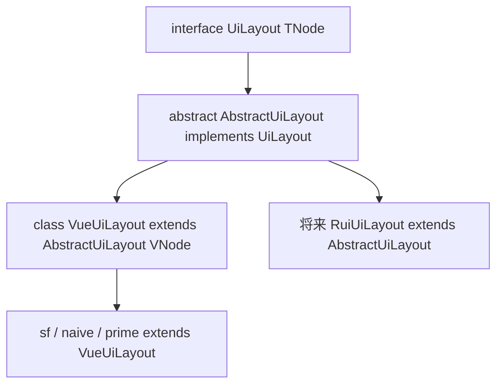

# 布局设计

契约在 [`@mmda/core` `src/ui/layout.ts`](../../core/src/ui/layout.ts)。Vue 实现是 [`VueUiLayout`](../src/ui/layout/layout.ts)。程序员用法：[layout_usage.md](./layout_usage.md)。

**不是** `factory.toolbar`（chrome 三栏条）。`UiLayout` 管字段栅格、分组、详情页区域、列表项，以及应用壳 `scaffold`。

## 分层

能不用 Vue 的算法在 core。vui / 以后的 rui 共用同一套 `TNode` 骨架。



| 层 | 做什么 |
|---|---|
| core `interface UiLayout<TNode>` | 契约：`cell`/`row`/`column`/`grid`、`layoutField`/`layoutFieldGroup`/`layoutPage`、`listTile` |
| core `abstract AbstractUiLayout<TNode>` | 上移的算法骨架，只调 `wrap`：`cell`/`row`/`column`/`grid`、`layoutField`/`layoutFieldGroup`/`layoutPage`、`listTile`；页体走 `pageBody` |
| vui `class VueUiLayout` | `h()` 实现 `wrap`；`pageBody` → `PageBody` |
| 皮肤 `extends VueUiLayout` | 可选覆盖 `listTile`；栅格用基类 `mmda-row` 等，不要为换厂商前缀覆写 `cell`/`row`/`column`/`grid` |

不要在 vui 再写一份同名 `interface UiLayout`。不要把 Vue 的 `VNodeChild` / `VNodeChildAtom` 写进 core。子节点就是 **`TNode` / `TNode[]`**。文本先 `factory.textSpan` 再进布局。

## 用词

横竖和布局属性一律 **`orientation`**，类型 **`UiOrientation`**：`'vertical' | 'horizontal'`。

| 要 | 不要 |
|---|---|
| `UiOrientation` | 新代码写 `UiDirection`（已 `@deprecated`） |
| 属性 `orientation` | 属性 `direction` |
| `UiFieldGroupType`：`'row' \| 'column' \| 'grid'` | 分组排法不要叫 `direction` |
| `mmda-field--horizontal` / `--vertical` | `data-direction` |
| `UiHorzAlign` / `UiVertAlign` | `UiHorzJustify`、flex `start`/`end` |

CSS class：字段测控为 `mmda-field` / `mmda-field-label` / `mmda-field-control` / `mmda-field-message error|warning`。分组为 `mmda-field-group mmda-field-group--grid` / `--row` / `--column`。栅格 `mmda-row` / `mmda-column` / `mmda-grid` 是语义钩子，排法在 inline style。

内容对齐是物理轴，跟 flex/grid 无关：

| 类型 | 靠一侧 / 居中 | 多子项分剩余空间 |
|---|---|---|
| `UiHorzAlign` | `left` / `center` / `right` | `between` / `around` / `evenly` |
| `UiVertAlign` | `top` / `middle` / `bottom` | `between` / `around` / `evenly` |

Toolbar 槽内只用 `left`/`center`/`right`。皮肤把 `between` 等映射成 CSS `space-between`。

`props` 用 **`UiProps`**。

## 接口

```ts
export interface UiLayout<TNode = any> {
  fieldVertical: boolean
  fieldGroupLayout: UiFieldGroupLayout
  gap: string
  scaffold(slots: UiAppScaffoldSlots<TNode>): TNode
  maxCols: number
  cell(child: TNode, nCol?: number): TNode
  row(children: TNode[], nCols: number[], props?: UiProps): TNode
  column(children: TNode[], props?: UiProps): TNode
  grid(children: TNode[], nCols: number[], props?: UiProps): TNode
  layoutField(slots: UiFieldSlots<TNode>): TNode
  layoutFieldGroup(options: UiFieldGroupProps<TNode>): TNode
  layoutPage(slots: UiPageSlots<TNode>): TNode
  listTile(slots: UiListTileSlots<TNode>): TNode
}
```

`listTile` 替代旧自由函数 `defaultListTile`。默认算法在 `AbstractUiLayout.listTile`（用 `this.row` / `this.column`）；皮肤要改外观就 override。

槽位：

| 类型 | 要点 |
|---|---|
| `UiFieldSlots` | `label` / `control` / `message?`：`TNode`；`messageKind?`：`'error' \| 'warning'`。方向读 `fieldVertical` |
| `UiFieldGroupProps` | 只 `fields: TNode[]`。排法读 `fieldGroupLayout`（`type` / `gridCols`） |
| `UiPageSlots` | `toolbar?`：`TNode`（有则永远 sticky）；`primary` / `summary?` / `tails?` / `footer?` |
| `UiAppScaffoldSlots` | `variant?` / `topBar?` / `nav?` / `page?` / `bottomBar?` |
| `UiListTileSlots` | `title` 必填；`leading` / `subtitle` / `trailing` 可选，均为 `() => TNode` |

## 抽象钩子

`layoutPage` 骨架：工具栏行（有则 sticky）+ `this.pageBody(slots)`。没有公开 `regions` 袋。

| 钩子 | 谁实现 |
|---|---|
| `wrap(tag, props, children)` | vui：`h(tag, …)`；`props` 为 `UiWrapProps`（className / style / attributes） |
| `pageBody(slots)` | core 缺省铺平 primary/tails/summary/footer；vui 返回 `[PageBody]` |
| `cell` / `row` / `column` / `grid` | `AbstractUiLayout` 默认实现；皮肤一般不覆写 |

`layoutField` / `layoutFieldGroup` / `layoutPage` / `listTile` 的结构（class、orientation、label+control）在 `AbstractUiLayout`，无 `h()`。class 一律 `uiCssClass`。

## Vue

`class VueUiLayout extends AbstractUiLayout<VNode>`。覆写 `pageBody`：`h(PageBody, …)`。不要再覆盖 `layoutPage`。

`PageBody` 留在 vui `components/`。rui 覆写 `pageBody` 即可。

应用壳走 `layout.scaffold`（`sidebarLeft` / `topBarFull`），与 `layoutPage` 不是一回事。
