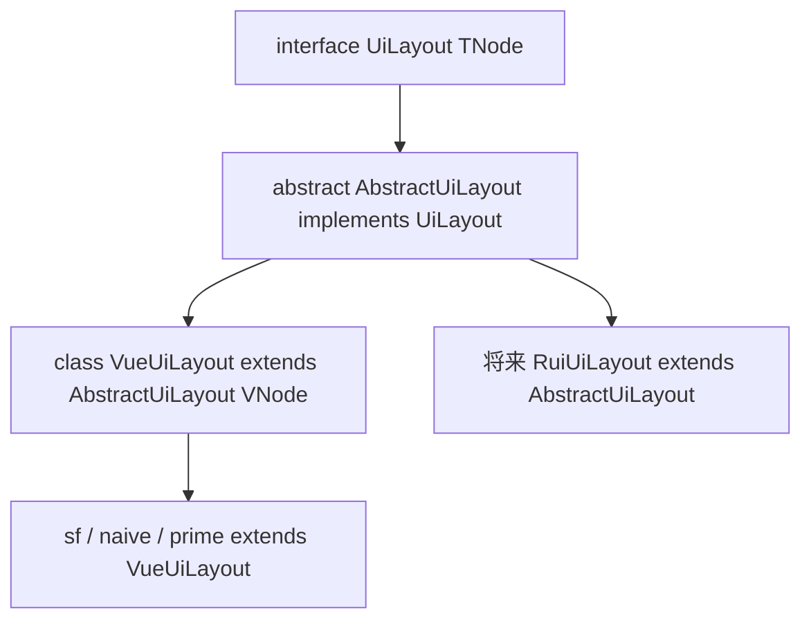

# 布局设计

契约在 [`@mmda/core` `src/ui/layout.ts`](../../core/src/ui/layout.ts)。Vue 实现是 [`VueUiLayout`](../src/ui/layout.ts)。程序员用法：[layout_usage.md](./layout_usage.md)。

**不是** `factory.toolbar`（原生命令条）。页头是 [Topbar](./topbar.md)。`UiLayout` 管字段栅格、分组、详情页区域、列表项，以及应用壳 `scaffold`。

## 分层

能不用 Vue 的算法在 core。vui / 以后的 rui 共用同一套 `TNode` 骨架。



| 层 | 做什么 |
|---|---|
| core `interface UiLayout<TNode>` | 契约：`cell`/`row`/`column`/`grid`、`layoutField`/`layoutFieldGroup`/`layoutPage`、`listTile` |
| core `abstract AbstractUiLayout<TNode>` | 上移的算法骨架，只调 `wrap`：`cell`/`row`/`column`/`grid`、`layoutField`/`layoutFieldGroup`/`layoutPage`（缺省铺平槽位）、`listTile` |
| vui `class VueUiLayout` | `h()` 实现 `wrap`；**覆写 `layoutPage`**（cards → `PageBody`；tabs → emphasis + 页签） |
| 皮肤 `extends VueUiLayout` | 可选覆盖 `listTile`；栅格用基类 `mmda-row` 等，不要为换厂商前缀覆写 `cell`/`row`/`column`/`grid` |

不要在 vui 再写一份同名 `interface UiLayout`。不要把 Vue 的 `VNodeChild` / `VNodeChildAtom` 写进 core。子节点就是 **`TNode` / `TNode[]`**。文本先 `factory.textSpan` 再进布局。

## 用词

横竖和布局属性一律 **`orientation`**，类型 **`UiOrientation`**：`'vertical' | 'horizontal'`。

| 要 | 不要 |
|---|---|
| `UiOrientation` | 新代码写 `UiDirection`（已 `@deprecated`） |
| 属性 `orientation` | 属性 `direction` |
| `UiFieldGroupType`：`'row' \| 'column' \| 'grid'` | 分组排法不要叫 `direction` |
| `mmda-field--horizontal` / `--vertical` | `data-direction` |
| `UiHorzAlign` / `UiVertAlign` | `UiHorzJustify`、flex `start`/`end` |

CSS class：字段测控为 `mmda-field` / `mmda-field-label` / `mmda-field-control`。校验文案由皮肤控件自绘。分组为 `mmda-field-group mmda-field-group--grid` / `--row` / `--column`。栅格 `mmda-row` / `mmda-column` / `mmda-grid` 是语义钩子，排法在 inline style。

内容对齐是物理轴，跟 flex/grid 无关：

| 类型 | 靠一侧 / 居中 | 多子项分剩余空间 |
|---|---|---|
| `UiHorzAlign` | `left` / `center` / `right` | `between` / `around` / `evenly` |
| `UiVertAlign` | `top` / `middle` / `bottom` | `between` / `around` / `evenly` |

Topbar 槽内只用 `left`/`center`/`right`。皮肤把 `between` 等映射成 CSS `space-between`。

`props` 用 **`UiProps`**。

## 接口

```ts
export interface UiLayout<TNode = any> {
  fieldVertical: boolean
  fieldGroupLayout: UiFieldGroupLayout
  gap: string
  scaffold(slots: UiAppScaffoldSlots<TNode>): TNode
  maxCols: number
  cell(child: TNode, nCol?: number): TNode
  row(children: TNode[], nCols: number[], props?: UiProps): TNode
  column(children: TNode[], props?: UiProps): TNode
  grid(children: TNode[], nCols: number[], props?: UiProps): TNode
  layoutField(slots: UiFieldSlots<TNode>): TNode
  layoutFieldGroup(options: UiFieldGroupProps<TNode>): TNode
  layoutPage(slots: UiPageSlots<TNode>): TNode
  listTile(slots: UiListTileSlots<TNode>): TNode
}
```

`listTile` 替代旧自由函数 `defaultListTile`。默认算法在 `AbstractUiLayout.listTile`：**nowrap 三槽 flex**（leading / body / trailing），中间 `flex:1`+`minWidth:0`；**不要**再实现成可 wrap 的加权 `row`。有 subtitle 时 body 内用 `column`。皮肤要改外观就 override。

### `row` / `cell` vs `grid` vs `listTile`

| API | 排法 | 权重含义 |
|---|---|---|
| `row` / `cell` | flex，可 wrap | `nCols[i]` / `nCol` → `flex: N 1 0` |
| `grid` | CSS grid | `nCols` → 各列 `fr`（字段组装箱） |
| `listTile` | flex nowrap 三槽 | 左右 auto，中间吃剩 |

槽位：

| 类型 | 要点 |
|---|---|
| `UiFieldSlots` | `label` / `control`：`TNode`。方向读 `fieldVertical`；校验文案不经 layout |
| `UiFieldGroupProps` | 只 `fields: TNode[]`。排法读 `fieldGroupLayout`（`type` / `gridCols`） |
| `UiPageSlots` | `toolbar?`；`pageLayout?: 'cards'\|'tabs'`；`banner?`；`emphasis?`（tabs 重要字段只读条）；`primary` / `summary?` / `tails?` / `footer?` |
| `UiAppScaffoldSlots` | `variant?` / `topBar?` / `nav?` / `page?` / `bottomBar?` |
| `UiListTileSlots` | `title` 必填；`leading` / `subtitle` / `trailing` 可选，均为 `() => TNode` |

## 抽象钩子

`layoutPage` 由各端实现完整页壳。core 缺省只铺平槽位；vui **覆写 `layoutPage`**（不再有 `pageBody` 钩子）。

| 钩子 | 谁实现 |
|---|---|
| `wrap(tag, props, children)` | vui：`h(tag, …)`；`props` 为 `UiWrapProps`（className / style / attributes） |
| `layoutPage(slots)` | core：toolbar + 槽位铺平；vui：cards→`PageBody`，tabs→banner/emphasis/primary |
| `cell` / `row` / `column` / `grid` | `AbstractUiLayout` 默认实现；皮肤一般不覆写 |

`layoutField` / `layoutFieldGroup` / `listTile` 的结构（class、orientation、label+control）在 `AbstractUiLayout`，无 `h()`。

### class 一律 `uiCssClass` / `uiCssClasses`

TS / Vue 组件拼 class **只**走 [`uiCssClass`](../../core/src/ui/css.ts) / `uiCssClasses`；禁止写死 `'mmda-foo'` 字符串。前缀只在 `UI_CSS_PREFIX`。CSS 选择器仍写编译后的 `.mmda-…`。

- `uiCssClass('page', 'body', 'with-summary')` → `mmda-page__body--with-summary`
- `uiCssClasses('section', 'main')` → `mmda-section mmda-section--main`

## 页面 CSS（BEM）

三块：`mmda-view`（模块工作区叠层）、`mmda-page`（一张列表或一张单页）、`mmda-section`（页体里的主区 / 摘要）。不写 `block__el__child`。`header` / `banner` / `body` / `footer` 都是 `mmda-page` 的元素，彼此平级。

Index 铺底常驻；Create / Edit / Details 进 `__one` **盖住**（绝对定位、不透明底），不用 `display:none`。盖住时工作区加 `mmda-view--covering`，列表槽 `aria-hidden`。

```
.mmda-app-page
  .mmda-view
    .mmda-view__index
      .mmda-page
        .mmda-page__header
        .mmda-page__body
          .mmda-page__content
            .mmda-section.mmda-section--main
    .mmda-view__one
      .mmda-page / .mmda-page--tabs
        .mmda-page__header
        .mmda-page__body
          .mmda-page__banner?
          .mmda-page__emphasis?          # tabs only
          .mmda-page__content            # cards
            .mmda-section.mmda-section--main
            .mmda-section.mmda-section--summary?
          .mmda-section.mmda-section--main.mmda-page__tabs?  # tabs
        .mmda-page__footer?
```

| class | 语义 |
|---|---|
| `mmda-view` | 模块视图工作区 |
| `mmda-view--covering` | One 盖着 Index |
| `mmda-view__index` | 列表槽 |
| `mmda-view__one` | 单页槽（create / edit / details） |
| `mmda-page` | 一页 |
| `mmda-page--tabs` | tabs 壳 |
| `mmda-page__header` | 顶栏 |
| `mmda-page__header--sticky` | 顶栏钉住 |
| `mmda-page__body` | 页体 |
| `mmda-page__banner` | 页顶通知 |
| `mmda-page__emphasis` | tabs 重要字段只读条；定 `--mmda-field-label-col` |
| `mmda-list-tile` / `__leading` / `__body` / `__trailing` | 列表项三槽；`__body` 省略 |
| `mmda-page__content` | cards：main \| summary 行 |
| `mmda-page__footer` | 页脚（与 header / body 平级） |
| `mmda-page__body--with-summary` | 有摘要 |
| `mmda-page__body--compact` | 窄屏 |
| `mmda-page__body--collapsed` | 摘要收起 |
| `mmda-section--main` | 主区（cards 下 `flex:2`） |
| `mmda-section--summary` | 摘要（cards 下 `flex:1`） |
| `mmda-section__toggle` / `__body` | 折叠钮 / 摘要内容 |

`mmda-form`、`mmda-list-view`、`mmda-index-topbar` / `mmda-details-topbar` / `mmda-edit-topbar`、`mmda-toolbar`、`mmda-field` 是独立块，不塞进上面这棵树当元素。

## Vue

`class VueUiLayout extends AbstractUiLayout<VNode>`。**覆写 `layoutPage`**：

- `pageLayout: 'cards'`（缺省）：sticky header + `PageBody`（banner → content 包 main+summary，摘要可折叠）+ footer
- `pageLayout: 'tabs'`：sticky header + body 纵向 banner → emphasis → primary（`factory.tabs` Fill）+ footer

FormBuilder：`cards` / `tabs` 组内字段默认横排；`tabs` 强调条用字段 `colSpan` 作 `row` flex 权重，条内字段仍横排。需要竖排时再显式传 `fieldVertical: true`。

`PageBody` 留在 vui `components/`，只服务 cards。rui / 其他端各自覆写 `layoutPage`，不要指望 core `pageBody` 钩子（已删除）。

应用壳走 `layout.scaffold`（`sidebarLeft` / `topBarFull`），与 `layoutPage` 不是一回事。`scaffold` 的根是 `.mmda-app-layout`，`page` 槽是 `.mmda-app-page`。AppShell 只做挂载根和登录门禁，不要再包一层 `.mmda-app`。

```
#app
  .mmda-app-layout
    nav | .mmda-app-page
```
